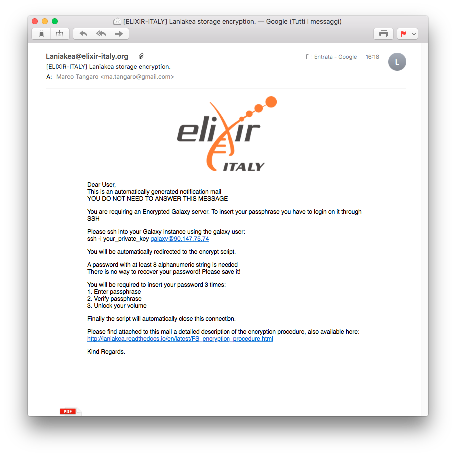
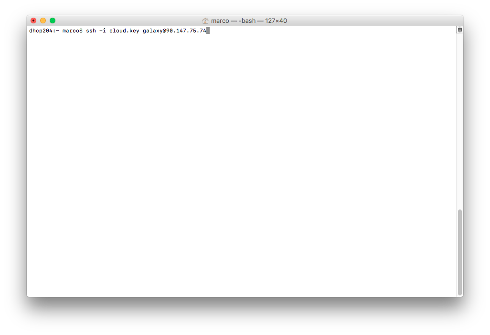
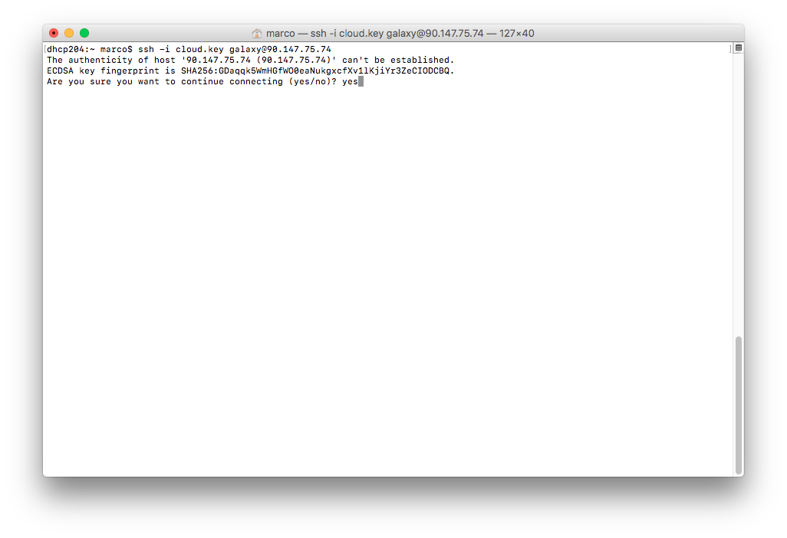
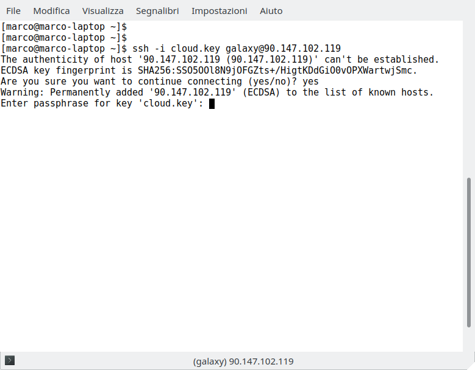
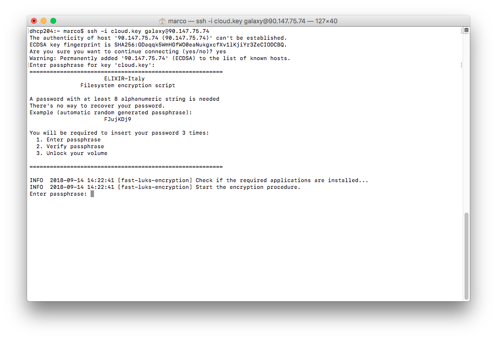
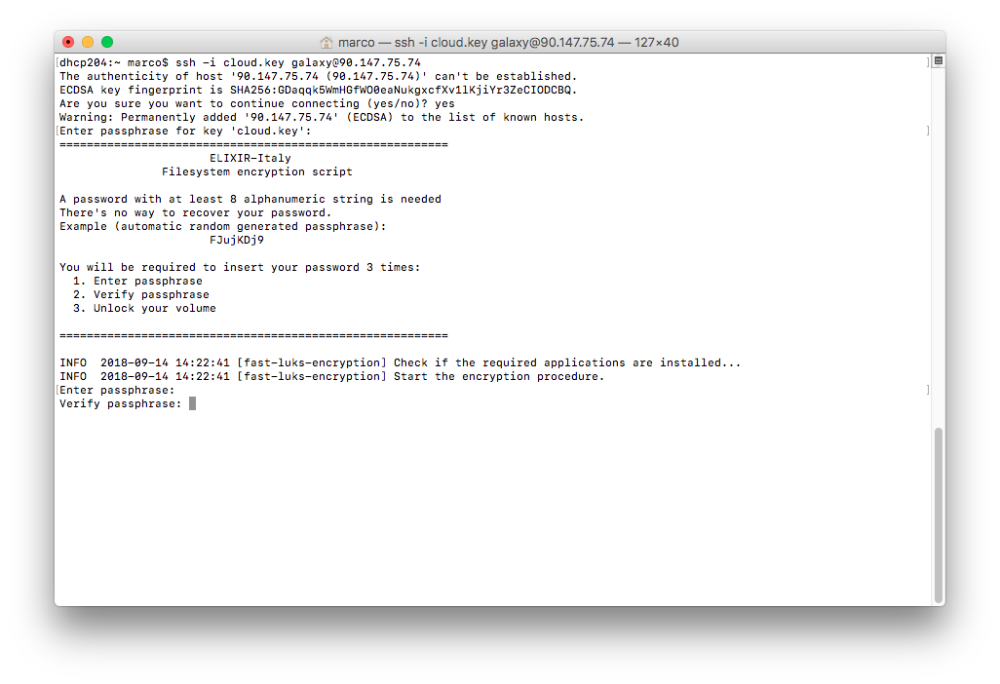
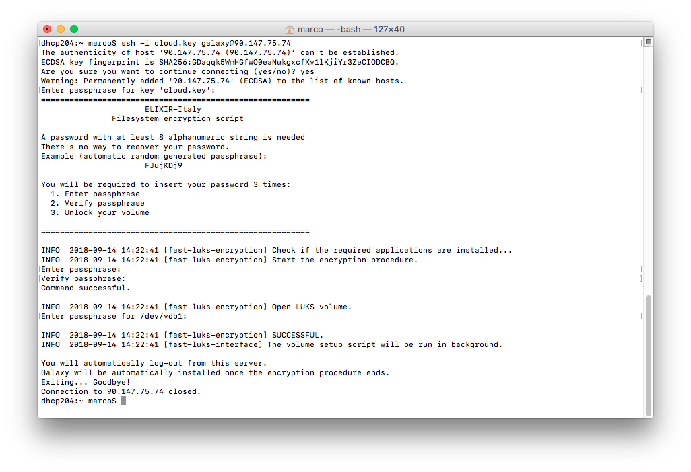

File System encryption procedure
================================

To encrypt the Virtual machine external volume follow this procedure.

VM login
--------

Log-in into your machine with:

``ssh -i your_private_ssh_key.key galaxy@virtual.machine.ip.address``

Typical ip addresses are: 90.147.170.XX or 90.147.102.XX.
You can copy and past the command from the mail the system send you.

Accept the connection typing "yes"

and enter your SSH passphrase:

Passphrase creation
--------------------

You will be now prompted in the encryption script automatically.
You will be required to insert an alphanumeric key, at least 8 characters.
A key is automatically generated, as example, plase do not use if for production!

You have to type your password three times:

#. | inject your password

#. | Confirm your password

#. | Unlock your encrypted volume

Insert your volume encrypt/decrypt password for the first time:

and confirm it:

If the passphrases don't match, restart the procedure.

Unlock the volume
-----------------

Unlock the encrypted volume typing again your password:

.. figure:: _static/encryption/FS_ecrypt_proc_07.png
   :scale: 70 %
   :align: center
   :alt: encrypt procedure 07

The volume will be now encrypted and you will be automatically get out the VM, until Galaxy is installed.

The system is now encrypted and unlocked, ready for Galaxy installation and configuration.
