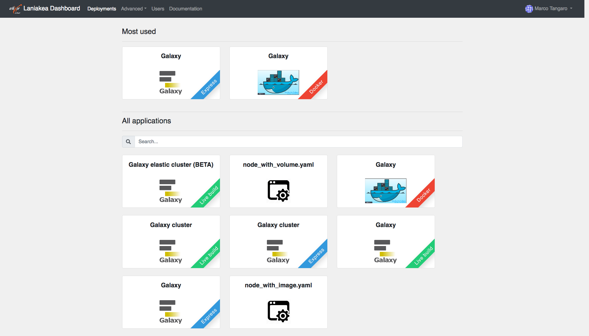
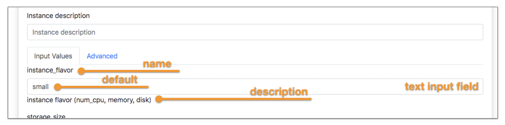

Add new applications
====================

The PaaS Layer accepts deployment requests in the form of TOSCA Templates (see section :doc:`../tosca_templates/tosca_templates`): a document (YAML syntax) describing the infrastructure to deploy, e.g. the virtual hardware and the software to be installed and configured. Galaxy TOSCA tempaltes are installed during Laniakea installation procedure automaticall on ``/opt/laniakea-dashboard-config/tosca-templates``

To add new TOSCA applications copy you tosca template in ``/opt/laniakea-dashboard-config/tosca-templates`` and restart the dashboard:

::

  # cp tosca_example.yml /opt/laniakea-dashboard-config/tosca-templates/

  # docker restart orchestrator-dashboard

New applications will be then desplayed in the **All applications** section of the dashboard home page.

The Dashboard parses the TOSCA document automatically and renders the user interface with user friendly forms. This allows to extend Laniakea functionalities just adding new templates without any code modification.

For example, the input field in the TOSCA template to select the instance flavour in terms of vCPUs, RAM and disk storage is:

::

  instance_flavor:
    type: string
    description: instance flavor (num_cpu, memory, disk)
    default: small

where the default value ``small`` corresponds to a VM with 1 CPU and 2 GB of RAM.

The user input field automatically rendered as text field on the dashboard, allowing the user to modify the flavour modifying the value:

.. note::

   The dashboard automatically renders **all** the entries in the input section of the tosca templates as text fields in the tab ``Ìnput values``, for user configuration.

TOSCA templates inputs and outputs name are arbitrary and can be customized. The dashboard support some keywords to enable special features like the SSH key injection and Galaxy restart. Currently available keywords are listed below.

Supported inputs
----------------

``instance_key_pub``: user SSH public key is available in the dashboard through the **SSH keys** page (see section :doc:`../qs_key_pair`). If configured, the public key is automatically assigned to a TOSCA template input value with this name if the input form is left empty. Otherwise, the value inserted in the input form will be assigned to ``instance_key_pub`` input.

.. note::

   Lanaiakea exploits this feature to automatically set user public key on Galaxy instances.

Supported outputs
-----------------

``endpoint``: if the endpoint output is present, it is displayed in the **deployments page** of the dashboard, in the endpoint column as clickable url.

``node_ip``: if available among the output values of the single node Galaxy instance, it is consumed by the dashboard as base url to contact the instance APIs to restart the encrypted storage and Galaxy if needed,

``cluster_ip``: if available among the output values of a Galaxy cluster,  it is consumed by the dashboard as base url to contact the instance APIs to restart the encrypted storage, the NFS between the nodes  and Galaxy.
