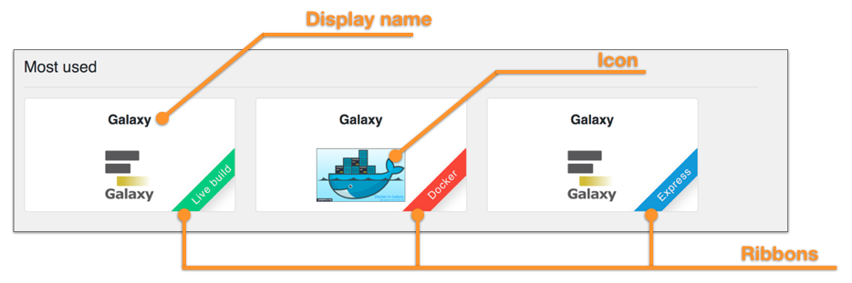
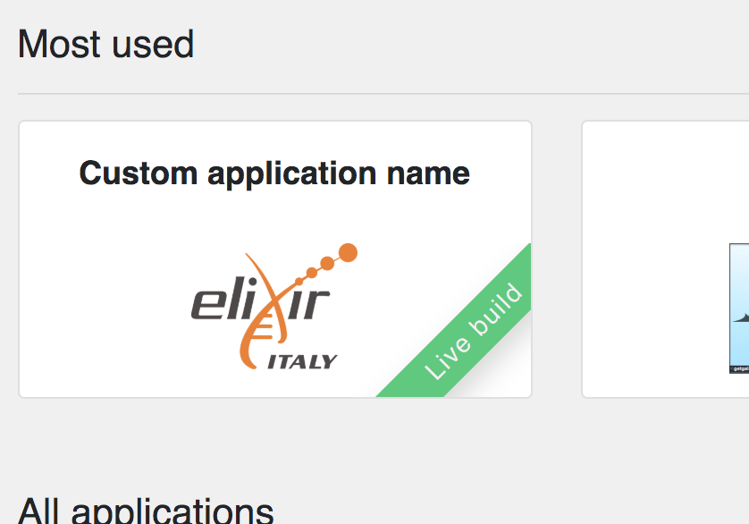
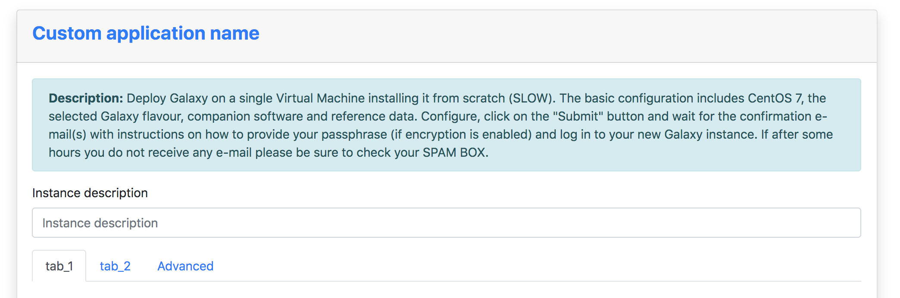
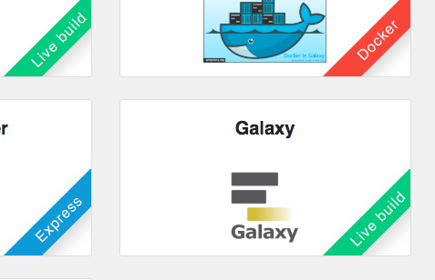

Application metadata
====================

The Laniakea dashboard needs some additional information to further customize each application, e.g. the image to show in the home page for each application.

To add metadata information, corresponding to the TOSCA template, a metadata file is needed. To be automatically parsed by the dashboard the file needs the same name of the TOSCA template file with the extention ``.metadata.yaml``. For example if the TOSCA template is named ``galaxy.yaml`` the corresponding meatadata file has to be named ``galaxy.metadata.yaml`` and has to be placed in ``/opt/laniakea-dashboard-config/tosca-metadata``.

.. note::

  The metadata directory can be modified in the dahsboard configuration file ``config.json`` (see section :doc:`config_json`).

Once added the metadata file, the dashboard needs to be restart to make changes effective.

The dashboard reads the content of this directory and automatically associate to each TOSCA template the corresponding metadata file, if existing.

Metadata file structure
-----------------------

The YAML metadata file has ony one section: metadata. For example:

::

  metadata:
    icon: https://galaxyproject.org/images/galaxy-logos/galaxy_project_logo_square.png
    display_name: "Galaxy"
    virtualization_type: "Docker"
    pinned: 'yes'
    pin_order: 0

Supported options
-----------------

--------
``icon``
--------

:Documentation:
	Define de image loaded in the application tile. If no image URL is provided, the Dashboard loads this `icon <https://cdn4.iconfinder.com/data/icons/mosaicon-04/512/websettings-512.png>`_.

:Example:
	::

	  metadata:
	    icon: https://elixir-europe.org/system/files/elixir_node_italy.png
	    ...

----------------  
``display_name``
----------------

:Documentation:
	Define the name of the application shown in the Dashboard home page and in the configuration form.

:Example:
        ::

          metadata:
            icon: https://elixir-europe.org/system/files/elixir_node_italy.png
            display_name: "Custom application name"
            ...

----------
``ribbon``
----------

:Documentation:
	Enable the ribbon on top bottom corner of each tile if ``True``.

:Example:
        ::

          metadata:
            icon: https://elixir-europe.org/system/files/elixir_node_italy.png
            display_name: "Custom application name"
            ribbon: true
            ribbon_tag: "Test"
            ribbon_color: "yellow"
            ...

-----------------------
``ribbon_tag``
-----------------------

:Documentation:
	Define the name to be shown within the colored ribbon on the bottom right corner of the tile. Currently, we adopted three values:
	``Express``: for those applications already installed in the image used to create the Virtual Instance, to speed-up the deployment.

	``Docker``: for those applications run using a Docker container.

	``Live build``: for those applications installed on a bare OS image from scratch.

:Example:
        ::

          metadata:
            icon: https://elixir-europe.org/system/files/elixir_node_italy.png
            display_name: "Custom application name"
            ribbon: true
            ribbon_tag: "Test"
            ribbon_color: "yellow"
            ...

----------------
``ribbon_color``
----------------

:Documentation:
	Define the color of the ribbons.
        Possible colors are: white, black, grey, blue, green, turquoise, purple, red, orange, yellow.

:Example:
        ::

          metadata:
            icon: https://elixir-europe.org/system/files/elixir_node_italy.png
            display_name: "Custom application name"
	    ribbon: true
	    ribbon_tag: "Test"
	    ribbon_color: "yellow"
            ...

----------
``pinned``
----------

:Description:
	Define the three applications which can be diplayed in the ``Most used`` top row.

:Example:
        ::

          metadata:
            icon: https://elixir-europe.org/system/files/elixir_node_italy.png
            display_name: "Custom application name"
            virtualization_type: "Live build"
	    pinned: 'yes'
            ...

-------------
``pin_order``
-------------

:Description:
	Define the order of the three pinned application: ``0`` for the first place, ``1`` for the second and ``2`` for the third.

:Example:
        ::

          metadata:
            icon: https://elixir-europe.org/system/files/elixir_node_italy.png
            display_name: "Custom application name"
            virtualization_type: "Live build"
            pinned: 'yes'
            pin_order: '0'
