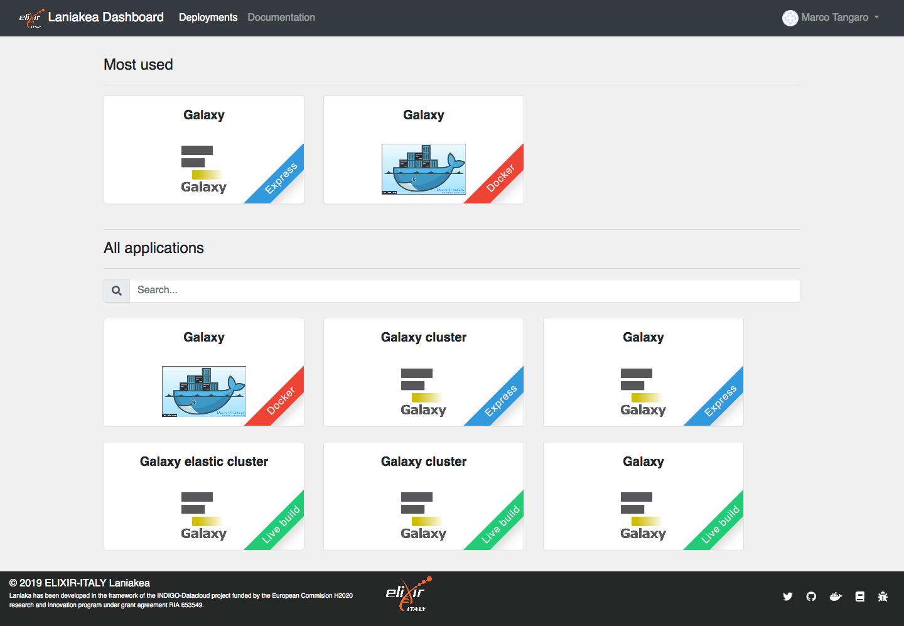
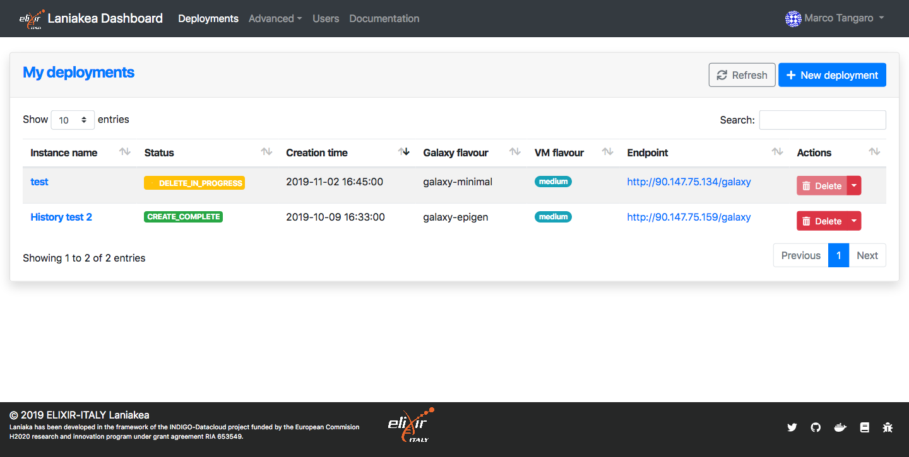
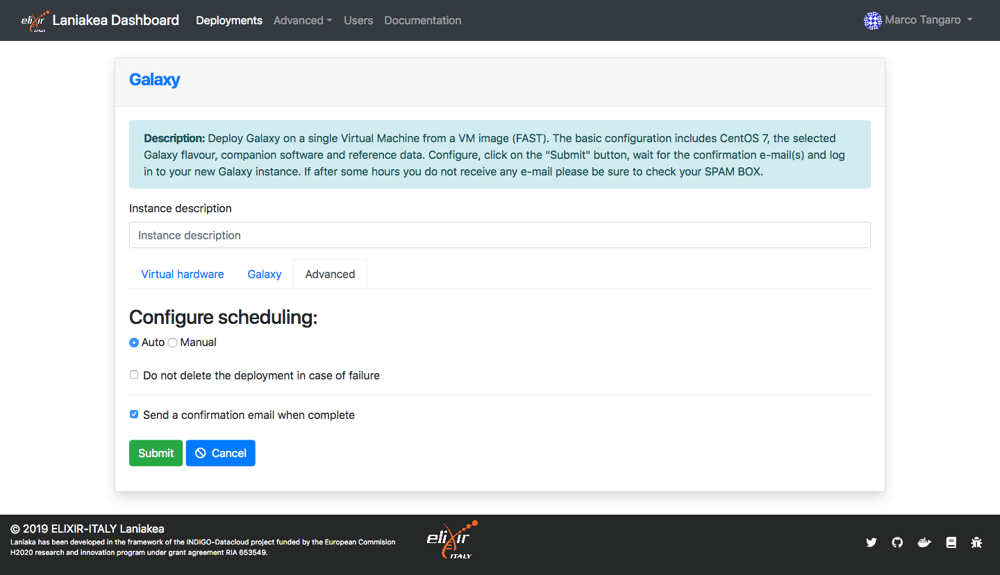
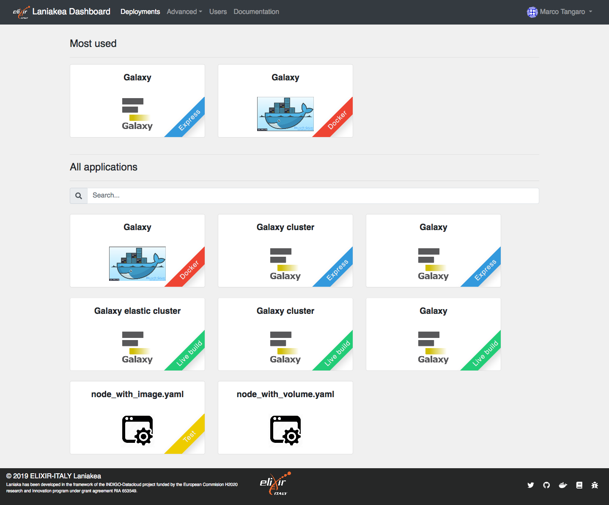
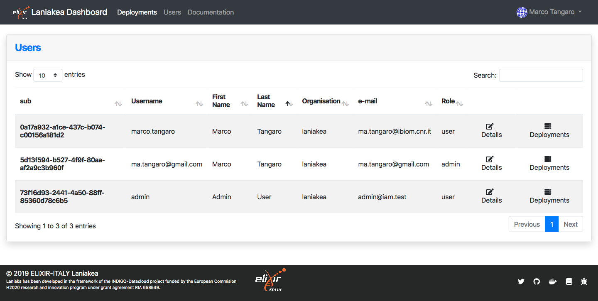
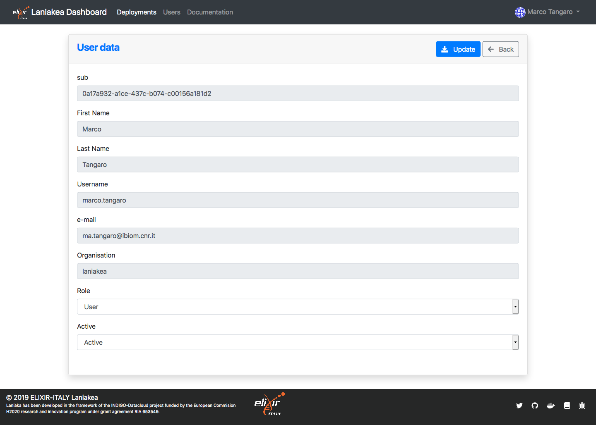
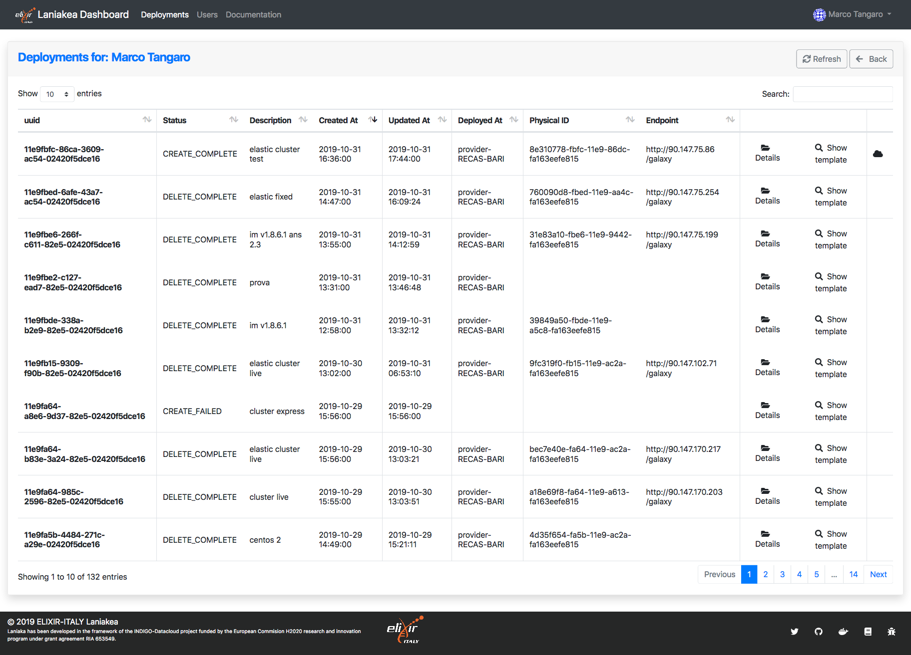

Overview
========

Home view
---------

The home page tiles show the available applications. The goal of each tile is to quickly display each application, with its description and configuration button.

Deployments list
----------------

Each user can manage its instances. It is possible to view details, delete and access instances. Finally, using the menu in the action column, It is also possible to view logs and the template used for each instance.

Advanced options
----------------

If advanced options are enabled in the Dashboard configuration file, a new ``Advanced`` dropdown menu becomes available in the navbar,

.. figure:: img/overview/advanced_slas_panel.png 
   :scale: 30 %
   :align: center

showing available Service Level Agreement

.. figure:: img/overview/advanced_settings_panel.png 
   :scale: 30 %
   :align: center

and Dashboard settings.

Administration panel
--------------------

For the Dashboard Administrator ``Users`` panel is available for advanced users management,

allowing to browse the Laniakea users,

user datails:

and user deployment list. The Deployment details can be inspected. The cloud icon in the last icon shows if the deployment is conncted to the INDIGO PaaS Orchestrator or not.

