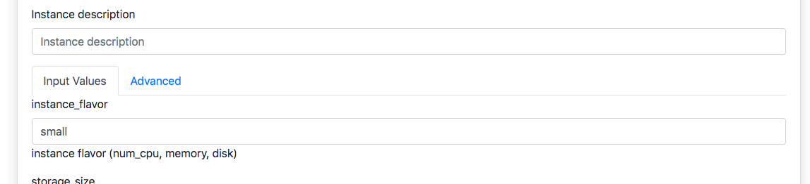
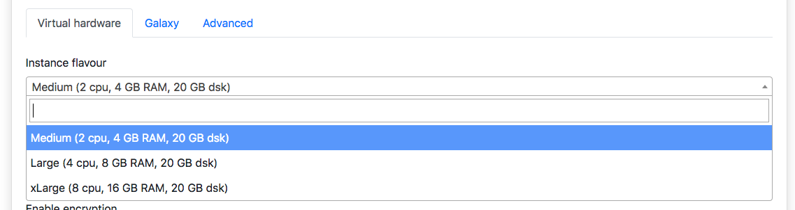

Application launcher forms customization
========================================

The dashboard automatically renders **all** the entries in the input section of the tosca templates as text fields, for user configuration. Despite this allows to easily increase Laniakea applications, it may be necessary to make available to users only some fields to be configured and only some options defined by the service provider.

For this reason we extended the TOSCA templates inputs to create configurable forms. This creates a flexible web interface, allowing straightforward customisation of the user experience through human readable YAML configuration files, which can be easily adapted adding new functionalities to the user interface (e.g. adding a dropdown menu, text fields, toggles…) based on the Laniakea administrator requirements.

To enable configurable forms a parameter file, corresponding to the TOSCA template, is needed. To be automatically parsed by the dashboard the file needs the same name of the TOSCA template file with the extention ``.parameters.yaml``. For example if the TOSCA template is named ``galaxy.yaml`` the corresponding parameters file has to be named ``galaxy.parameters.yaml`` and has to be placed in ``/opt/laniakea-dashboard-config/tosca-parameters``.

.. note::

  The parameters directory can be modified in the dahsboard configuration file ``config.json`` (see section :doc:`config_json`).

The dashboard reads the content of this directory and automatically associate to each TOSCA template the corresponding parameters file, if existing.

.. note::

   If the parameters file is available, only the inputs present within it will be shown on the dashboard user interface, allowing to select which TOSCA template input to customize and show.

For example, referring again to the input field to configure the VM virtual hardware, named ``ìnstance_flavor``, we have the following TOSCA template input:

::

  instance_flavor:
    type: string
    description: instance flavor (num_cpu, memory, disk)
    default: small

Rendered as an input text field:

The value ``small``, which corresponds to a VM with 1 CPU and 2 GB of RAM, will be displayed as default value in an input text field, allowing the user to modify it and change the VM configuration.

This requires the user to know the hardware presets available on the infrastructure, their names and, above all, it would allow them to choose any possible presets knowing their names.

It is possible to customize this input value inserting an entry **with the same name** in the **YAML** parameters file.

For the ``ìnstance_flavor`` input, for example, we will have as parameter file input:

::

  instance_flavor:
    display_name: "Instance flavour"
    tag_type: "select"
    description: "CPUs, memory size (RAM), root disk size"
    constraints:
      - { value: "medium", label: "Medium (2 cpu, 4 GB RAM, 20 GB dsk)" }
      - { value: "large", label: "Large (4 cpu, 8 GB RAM, 20 GB dsk)" }
      - { value: "xlarge", label: "xLarge (8 cpu, 16 GB RAM, 20 GB dsk)" }
    tab: "Virtual hardware"

Which is rendered as a dropdown menu on the dashboard:

.. toctree::
   :maxdepth: 2

   parameters_file_structure
   parameters_inputs
   parameters_tags
