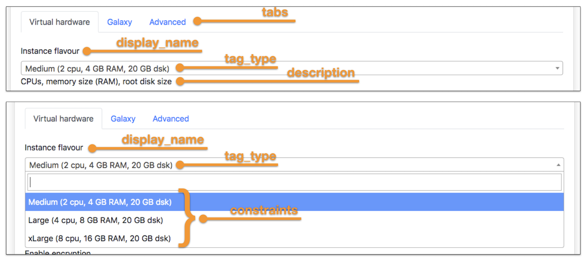

Input parameters options
========================

Each entry in the YAML parameters file can be customized in order to simplify the user intercation with the UI.

The Laniakea dashboard supports the following options.

----------------
``display_name``
----------------

:Description:
	The name that will be displayed in the form.

:Example:
	::

	  input_name: value
	    display_name: <name_to_be_displayed>
	    ...

------------
``tag_type``
------------

:Description:
	Set the tag to be used in the form to generate dropdown menu, radio button... Currently, the following tags are available: text, hidden, email, password, select, radio, ssh_pub_key_type.

        More on the available tag types can be found in the section: :doc:`parameters_tags`.

:Example:
        ::

          input_name: value
            display_name: <name_to_be_displayed>
            tag_type: <selected_tag_type>
            ...

---------------
``description``
---------------

:Description:
	Override the descripion present in the tosca template input field.

:Example:
        ::

          input_name: value
            display_name: <name_to_be_displayed>
            tag_type: <selected_tag_type>
            description: <custom_description_of_the_input>
	    ...

---------------
``placeholder``
---------------

:Description:
	The placeholder attribute specifies a short hint that describes the expected value of an input field/text area.
	It is available for the following tag_types: ``text``, ``email``, ``password``, ``ssh_pub_key_type``.

:Example:
        ::

          input_name: value
            display_name: <name_to_be_displayed>
            tag_type: <selected_tag_type>
            description: <custom_description_of_the_input>
	    placeholder: <custom_placeholder_of_the_input>
            ...

---------------
``constraints``
---------------

:Description:
	The constraint option is used to define the possible options to choose from. For instance, for ``select`` tag type it is possible to specify the selectable values.

	It is possible to configure a value attribute, which is the value assigned to the input after the selection, and a label attribute to display.

:Example:
	::

          input_name: value
            display_name: <name_to_be_displayed>
            tag_type: <selected_tag_type>
            description: <custom_description_of_the_input>
	    constraints:
	      - { value: "<value_attribute>", label: "<displayed_label>" }
	      - { value: "<value_attribute>", label: "<displayed_label>" }
	      - { value: "<value_attribute>", label: "<displayed_label>" }
	      ...
	    ...

------------
``required``
------------

:Description:
	When present it specifies that the input field must be mandatorly filled out before submitting the form.

:Example:
        ::

          input_name: value
            display_name: <name_to_be_displayed>
            tag_type: <selected_tag_type>
            description: <custom_description_of_the_input>
            constraints:
              - { value: "<value_attribute>", label: "<displayed_label>" }
              - { value: "<value_attribute>", label: "<displayed_label>" }
              - { value: "<value_attribute>", label: "<displayed_label>" }
              ...
            required: <yes_or_no>

-------
``tab``
-------

:Description:
        The tab where the input must be shown.

:Example:
        ::

          input_name: value
            display_name: <name_to_be_displayed>
            tag_type: <selected_tag_type>
            description: <custom_description_of_the_input>
            constraints:
              - { value: "<value_attribute>", label: "<displayed_label>" }
              - { value: "<value_attribute>", label: "<displayed_label>" }
              - { value: "<value_attribute>", label: "<displayed_label>" }
              ...
	    required: <yes_or_no>
            tab: <custom_tab>
