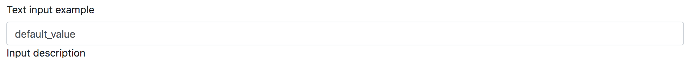
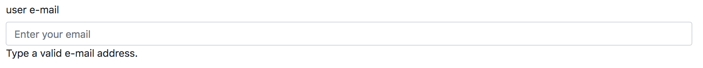
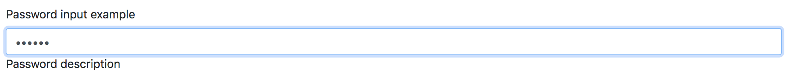
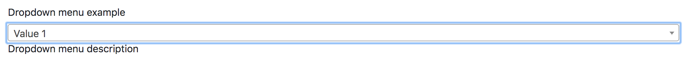
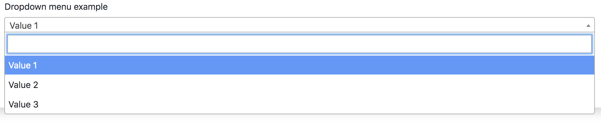
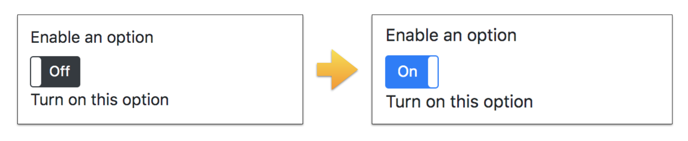
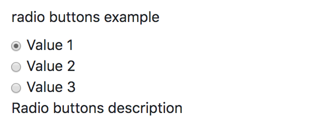
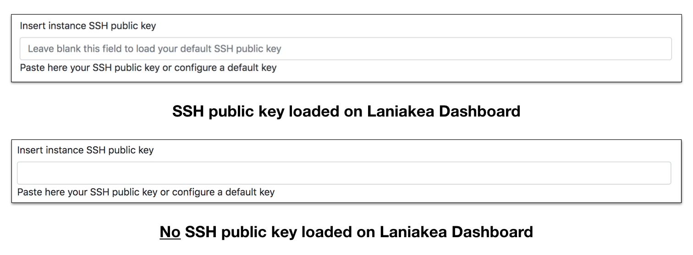

Available tag types
===================

The Laniakea dashboard currently supports the following tag_types allowing to differentiate user interactions with the UI.

--------
``text``
--------

:Description:
	Defines a one-line text input field.

:Example:
	::

          input_example:
	    display_name: "Text input example"
	    tag_type: "text"
	    description: "Input description"
	    default: "default_value"
	    tab: "tab_2"

----------
``hidden``
----------

:Description:
	Define an hidden input. The user will not see any entry in the configuration form. Despite this, the dashboard will automatically assign a value to this input.

	For example the token to write secrets to vault is assigned with this system, without the user noticing.

        .. warning::

           If defined in the tabs section, the  tab field is requred.

:Example:
	::

	  input_example:
	    tag_type: "hidden"
	    default: hidden_default_value
	    tab: "tab_1" # Hidden fields needs a tab, if tabs are defined.

---------
``email``
---------

:Description:
	The email tag defines a field for an e-mail address. The input value is automatically validated to ensure it is a properly formatted e-mail address.

:Example:
	::

	  email_input_example:
	    display_name: "user e-mail"
	    tag_type: "email"
	    description: "Type a valid e-mail address."
	    tab: "tab_1"
	    required: yes

------------
``password``
------------

:Description:
	Defines a password field, i.e. a text field with hidden input.

:Example:
	::
	
	  password_input_example:
	    display_name: "Password input example"
	    tag_type: "password"
	    description: "Password description"
	    default: "default_value"
	    tab: "tab_1"

----------
``select``
----------

:Description:
	Create drop down list of options, which appears when clicking on form element and allows the user to choose one of the options. The options are described using the constraint attribute.

:Example:
	::
	
	  input_example:
	    display_name: "Dropdown menu example"
	    tag_type: "select"
	    description: "Dropdown menu description"
	    constraints:
	      - { value: "value1", label: "Value 1" }
	      - { value: "value2", label: "Value 2" }
	      - { value: "value3", label: "Value 3" }
	    tab: "tab_1"

----------
``toggle``
----------

:Description:
	Create a On/Off toggle. ``On`` values can be set ìn the constraints option.

:Example:
	::
	
	  input_example:
	    display_name: "Enable an option"
	    tag_type: "toggle"
	    description: "Turn on this option"
	    constraints:
	      - { value: "True", label: "On" }
	    tab: "tab_1"

---------
``radio``
---------

:Description:
	Create a radio button to select one of many choices.

:Example:
	::
	
	  input_example:
	    display_name: "Radio buttons example"
	    tag_type: "radio"
	    description: "Radio buttons description"
	    constraints:
	      - { value: "value1", label: "Value 1" }
	      - { value: "value2", label: "Value 2" }
	      - { value: "value3", label: "Value 3" }
	    tab: "tab_1"

--------------------
``ssh_pub_key_type``
--------------------

:Description:
	Special tag for ssh public key input. It is a ``text`` field to insert a SSH public key.
        If the ssh public key is set in the corresponding page (see section :doc:`../qs_key_pair`) a placeholder is shown to remember te possibility to load the default key.
        If no ssh public key is set, nothing is displayed as placeholder. 

	.. warning::

           The input option has to be mandatorily named ``instance_key_pub`` in both TOSCA template and parameter file.

:Example:
	::
	
	  instance_key_pub:
	    display_name: "Insert instance SSH public key"
	    tag_type: "ssh_pub_key_type"
	    description: "Paste here your SSH public key or configure a default key"
	    placeholder: 'Leave blank this field to load your default SSH public key'
	    tab: "tab_1"
	    required: yes

