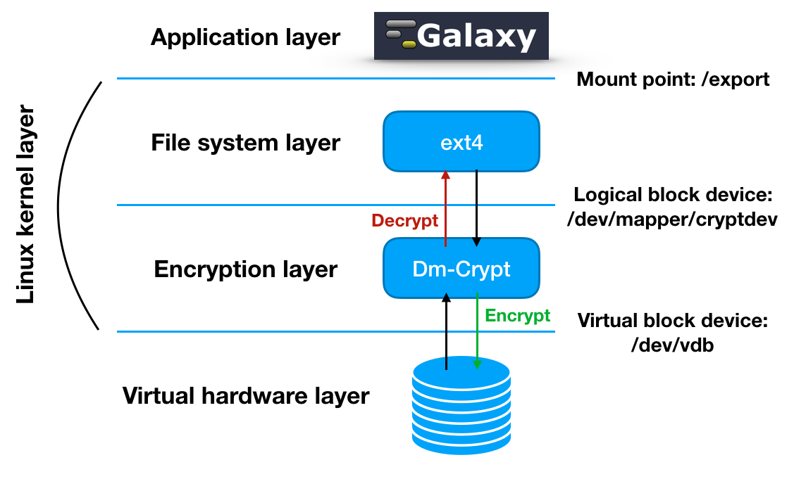

The encryption layer
====================

While the adoption of a distributed environment for data analysis makes data difficult to be tracked and identified by a malevolus attacker, full data anonymity and isolation is still not granted.

The user data privacy is granted through LUKS storage encryption as a service: data are isolated from any other instance on the same platform and from the cloud service administrators.
In the past version, users were required to insert a password to encrypt/decrypt data directly on the virtual instance during its deployment, through SSH connection.

In the second Laniakea release the encryption procedure has been completely re-worked and automated in order to simplify the user experience: now the user can encrypt storage on-demand, using a strong random alphanumerical passphrase, without having to interact with the Galaxy instance through SSH.
This has been achieved integrating the key management system Hashicorp Vault (vaultproject.io) to store encryption keys, which are shown in the Laniakea Dashboard only if explicitly requested by the user.

Disk encryption ensures that files are stored on disk in an encrypted form: the files only become available to the operating system and applications in readable when the volume is unlocked by a trusted user. The adopted block device encryption method, operates below the filesystem layer and ensures that everything is written to the block device (i.e. the external volume) is encrypted. 

The encryption layer sits between the physical disk and the file system and Galaxy is unaware of storage encryption. Galaxy exploits a specific mount point in order to store and retrieve files. Files are encrypted when stored to disk and decrypted when read.

.. toctree::
   :maxdepth: 2

   encryption_strategy
   encryption_workflow
   encryption_test
   fast_luks
   luksctl
   luksctl_api
   cryptsetup_hints

References
----------

#. `LUKS <https://gitlab.com/cryptsetup/cryptsetup>`_
#. `Disk encryption archlinux wiki page <https://wiki.archlinux.org/index.php/disk_encryption#Block_device_encryption_specific>`_
#. `Dm-crypt archlinux wiki page <https://wiki.archlinux.org/index.php/Dm-crypt/Device_encryption#Encryption_options_for_LUKS_mode>`_
#. `LUKS how-to <http://www.thegeekstuff.com/2016/03/cryptsetup-lukskey>`_
#. `Original LUKS script <https://github.com/JohnTroony/LUKS-OPs/blob/master/luks-ops.sh>`_ (Credits to John Troon for the original script)
