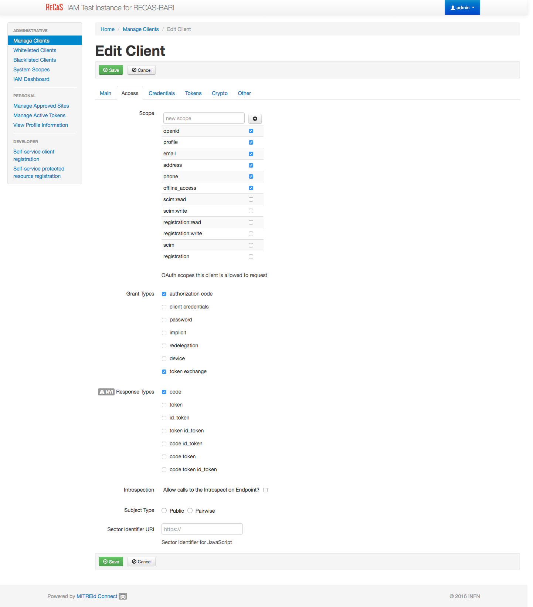

Install Laniakea dashboard (database and vault version)
=======================================================

.. Warning::

   Vault integration leverages on MySQL database. It can't work with dashboard stateless version

Update the dashboard IAM client configuration 
---------------------------------------------

To enable Vault integration the **token exchange** is needed. Therefore, edit the IAM client previously created for the dashboard.

Enable **token exchange** accessing to the client configuration page as Administrator user, through the **ADMINISTRATIVE**, **Manage Clients** and check the flag ``token exchange`` in the ``Grany types`` section.

IAM client configuration for Vault
----------------------------------

Create another IAM client for Vault, to enable oidc integration to authenticate users.

#. Login on IAM then **MitreID Dashboard** and select **Self-service client registration** as Administrator user.

#. Click on **New client** with the following paramethers

   ::

     Client name: vault_client

     redirect URI(s): https://<dashboard_vm_dns_name>:8200/ui/vault/auth/oidc/oidc/callback
                      https://<dashboard_vm_dns_name>:8250/oidc/callback

   .. figure:: _static/vault/vault_client_main.png
      :scale: 30%
      :align: center

#. In the Access tab select the follwing **Scopes**

   ::

     Scopes: openid, profile, email, address, phone, offline_access

   .. figure:: _static/vault/vault_client_access.png
      :scale: 30%
      :align: center

#. Save the client.

#. Save **Client ID**, **Client Secret** and **Registration Access Token** or the full output json in the **JSON** tab for future access.

Installation
------------

Create the file ``indigopaas-deploy/ansible/inventory/group_vars/orchestrator-dashboard.yaml`` with the following configured values:

::

  dashboard_fqdn: <dashboard_vm_dns_name>
  dashboard_image_name: laniakeacloud/laniakea-dashboard
  
  dashboard_iam_issuer: "https://<iam_address>/"
  dashboard_iam_client_id: "<im_client_id>'"
  dashboard_iam_client_secret: "<iam_client_secret>"
  dashboard_orchestrator_url: "https://<proxy_vm_dns_name>/orchestrator"
  
  dashboard_tosca_template_repository_url: https://github.com/Laniakea-elixir-it/laniakea-dashboard-config.git
  dashboard_tosca_template_repository_dir: "/opt/laniakea-dashboard-config"
  dashboard_tosca_templates_dir: "/opt/laniakea-dashboard-config/tosca-templates"
  dashboard_tosca_parameters_dir: "/opt/laniakea-dashboard-config/tosca-parameters"
  dashboard_tosca_metadata_dir: "/opt/laniakea-dashboard-config/tosca-metadata"
  dashboard_slam_url: "https://<slam_vm_dns_name>:8443"
  dashboard_cmdb_url: "https://<proxy_vm_dns_name>/cmdb"
  dashboard_administrators: "['<valid_email_address>']"
  
  dashboard_letsencrypt_email: "<valid_email_address>"

  dashboard_enable_db: True
  dashboard_db_sql_file_url: "https://raw.githubusercontent.com/Laniakea-elixir-it/orchestrator-dashboard/laniakea-stable/utils/orchestrator_dashboard.sql"
  dashboard_mysql_root_password: *****
  dashboard_db_password: ******

  dashboard_enable_vault: True
  dashboard_vault_token: "<vault_valid_token>"
  dashboard_vault_iam_client_id: "vault_iam_client_id>"
  dashboard_vault_iam_client_secret: "<vault_iam_client_secret"

.. warning::

   Set also your custom mysql password with: ``dashboard_mysql_root_password`` and ``dashboard_mysql_password``.

.. note::

   A valid token to create policies and enable OIDC authentication on vault is needed. Here, for simplicity we use the root token gathered in the Vault installation section :doc:`vault`.

Run the role using the ``ansible-playbook`` command:

::

  # cd indigopaas-deploy/ansible 

  # ansible-playbook -i inventory/inventory playbooks/deploy-orchestrator-dashboard.yml

Video Tutorial
--------------

.. raw:: html

   
