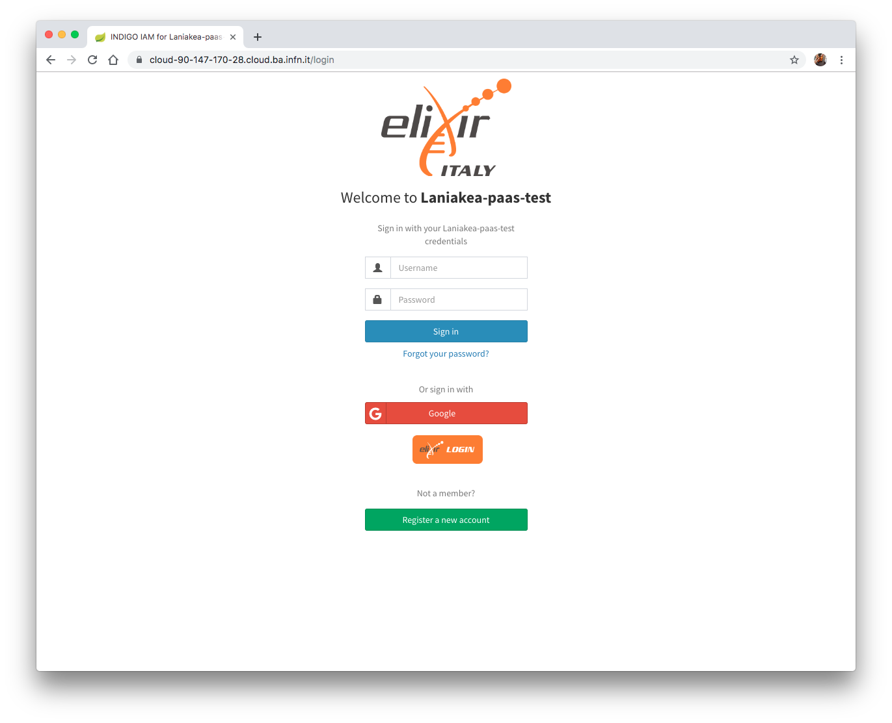

Identity Access Manager (IAM)
=============================

The INDIGO Identity and Access Management (IAM) is an Authentication and Authorisation Infrastructure (AAI) service which manages users credentitials and attributes, like group membership,  and authorization policies to access the resources.

.. note::
   Current IAM version: v1.5.0.rc2

.. note::

   After IAM installation it is needed to configure the Cloud provider identity service to accept the INDIGO IAM OpenID Connect authentication. For Openstack Keystone this is a standard configuration and the documentation can be found `here <https://indigo-dc.gitbook.io/keystone-with-oidc-documentation/>`_. Furthermore, to enable more OpenID Connect providers configured in the apache mod_auth_openidc module used by Keystone, in order to not change Keystone configuration, it is possible to exploit the `ESACO plugin <https://github.com/indigo-iam/esaco>`_. At the moment, for example, it is used with OpenStack at ReCaS-Bari datacenter. An example of integration is available `here <https://github.com/andreaceccanti/esaco-integration>`_.

VM configuration
----------------

Create VM for IAM. The VM should meet the following minimum requirements:

======= ==============================
OS      Ubuntu 16.04
vCPUs   2
RAM     4 GB
Network Public IP address.
======= ==============================

.. warning::

   All the command will be run on the control machine.

Enable Google Authentication
----------------------------

To enable Google authentication access to `Google developers console <https://console.developers.google.com/apis/credentials>`_ and create and configure a new credential project.

#. Create Credentials > OAuth Client ID

#. Application Type: Web Application

#. Name: Set a custom Service Provider (SP) name

#. Authorized JavaScript origins: https://<iam_vm_dns_name>.

#. Authorized redirect URIs: https://<iam_vm_dns_name>/openid_connect_login

#. Create the client

#. Copy your client ID and client secret

Create the file ``indigopaas-deploy/ansible/application-oidc.yml``, copying and pasting the client ID, client Secret and the IAM url

::

  oidc:
  providers:
  - name: google
    issuer: https://accounts.google.com
    client:
      clientId: <iam_google_client_id>
      clientSecret: <iam_google_client_secret>
      redirectUris: https://<iam_url>/openid_connect_login
      scope: openid,profile,email,address,phone
    loginButton:
      text: Google
      style: btn-social btn-google
      image:
        fa-icon: google

Enable ELIXIR-AAI Authentication
--------------------------------

To enable you need to request a valid client ID and client Secret. Please read the corresponding `documentation <https://elixir-europe.org/services/compute/aai>`_.

Then create the file ``indigopaas-deploy/ansible/application-oidc.yml``, copying and pasting the client ID, client Secret and the IAM url:

::

  oidc:
  providers:
  - name: elixir-aai
    issuer: https://login.elixir-czech.org/oidc/
    client:
      clientId: <iam_elixiraai_client_id>
      clientSecret: <iam_elixiraai_client_secret>
      redirectUris: https://<iam_fqdn>/openid_connect_login
      scope: openid,groupNames,bona_fide_status,forwardedScopedAffiliations,email,profile
    loginButton:
      text:
      style: no-bg
      image:
        url: https://raw.githubusercontent.com/Laniakea-elixir-it/ELIXIR-AAI/master/login-button-orange.png
        size: medium

Installation
------------

In the following, both Google and ELIXIR-AAI authentication methods will be enabled. To achieve this the ``indigopaas-deploy/ansible/application-oidc.yml`` with Google and ELIXIR-AAI corresponding clients ID and clients Secret, looks like:

::

  oidc:
  providers:
  - name: google
    issuer: https://accounts.google.com
    client:
      clientId: <iam_google_client_id>
      clientSecret: <iam_google_client_secret>
      redirectUris: https://<iam_fqdn>/openid_connect_login
      scope: openid,profile,email,address,phone
    loginButton:
      text: Google
      style: btn-social btn-google
      image:
        fa-icon: google
  - name: elixir-aai
    issuer: https://login.elixir-czech.org/oidc/
    client:
      clientId: <iam_elixiraai_client_id>
      clientSecret: <iam_elixiraai_client_secret>
      redirectUris: https://<iam_fqdn>/openid_connect_login
      scope: openid,groupNames,bona_fide_status,forwardedScopedAffiliations,email,profile
    loginButton:
      text:
      style: no-bg
      image:
        url: https://raw.githubusercontent.com/Laniakea-elixir-it/ELIXIR-AAI/master/login-button-orange.png
        size: medium

Create the file ``indigopaas-deploy/ansible/inventory/group_vars/iam.yaml`` with the following configured values:

::

  iam_fqdn: <iam_vm_dns_name>
  iam_mysql_root_password: *******
  iam_organization_name: '<your_organization_name>'
  iam_logo_url: <logo_url>
  iam_account_linking_disable: true
  iam_mysql_image: "mysql:5.7"
  iam_image: indigoiam/iam-login-service:v1.5.0.rc2-SNAPSHOT-latest
  iam_notification_disable: true
  iam_notification_from: 'iam@{{iam_fqdn}}'
  iam_enable_oidc_auth: true
  iam_application_oidc_path: "/root/indigopaas-deploy/ansible/application-oidc.yml"
  iam_admin_email: '<valid_email_address>'

.. warning::

   Set also your custom mysql password with: ``iam_mysql_root_password``.

.. warning::

   Please provide a valid e-mail address, which is mandatory for Let's Encrypt certificate creation.

It is possible to enable mail notification adding the following parameters:

::

  iam_notification_disable: false
  iam_notification_from: 'laniakea-alert@example.com'
  iam_notification_admin_address: <valid_email_address>
  iam_mail_host: <mail_server_address>

This is needed to allow user registration, e.g. to enable confirmation e-mails.

Run the role using the ``ansible-playbook`` command:

::

  # cd indigopaas-deploy/ansible

  # ansible-playbook -i inventory/inventory playbooks/deploy-iam.yml

.. note::

   Default administrator credentials:
 
   ::

     username: admin
     password: password

.. centered:: Fig.2: IAM login page

Video tutorial
--------------

.. raw:: html

   

IAM test
--------
Basic IAM tests.

Test 1: login as admin 
^^^^^^^^^^^^^^^^^^^^^^

#. Login as admin

   ::

      username: admin
      password: password

.. Warning:: Change the default password.

Test 2: Register a new user
^^^^^^^^^^^^^^^^^^^^^^^^^^^

#. Click Register a new account
#. Fill the form
#. Login as admin and accept the request
#. Login as new user

The full registration procedure is described in the :doc:`/user_documentation/authentication/authentication` section.

Test 3: Register using Google account (optional)
^^^^^^^^^^^^^^^^^^^^^^^^^^^^^^^^^^^^^^^^^^^^^^^^

#. Sign-in with Google 
#. Login as admin and accept the request
#. Login with Google

The full registration procedure is described in the :doc:`/user_documentation/authentication/authentication` section.

Create IAM Client
-----------------

Registered clients allow to request and receive information about authenticated end-users. Each INDIGO service must authenticate to a dedicated IAM client using a **client id** a **client secret**.

To create a IAM **client** or a **protetect resource**, please follow these instructions:

.. toctree::
   :maxdepth: 2

   iam_client

Obtaining an IAM access token
-----------------------------

To get a vaild IAM access token, please follow these instructions:

.. toctree::
   :maxdepth: 2

   iam_token
