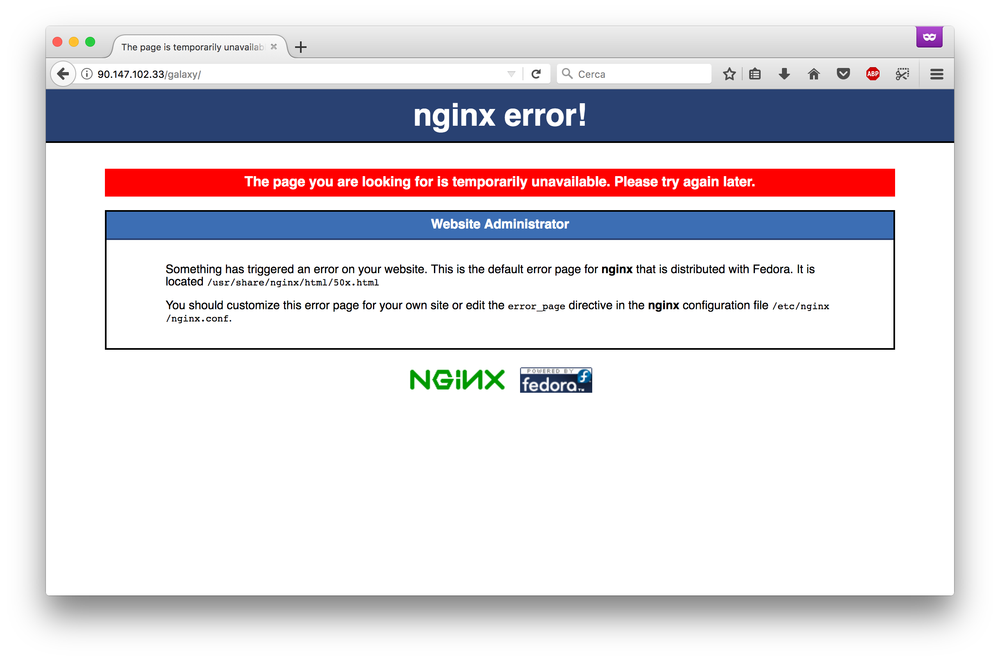
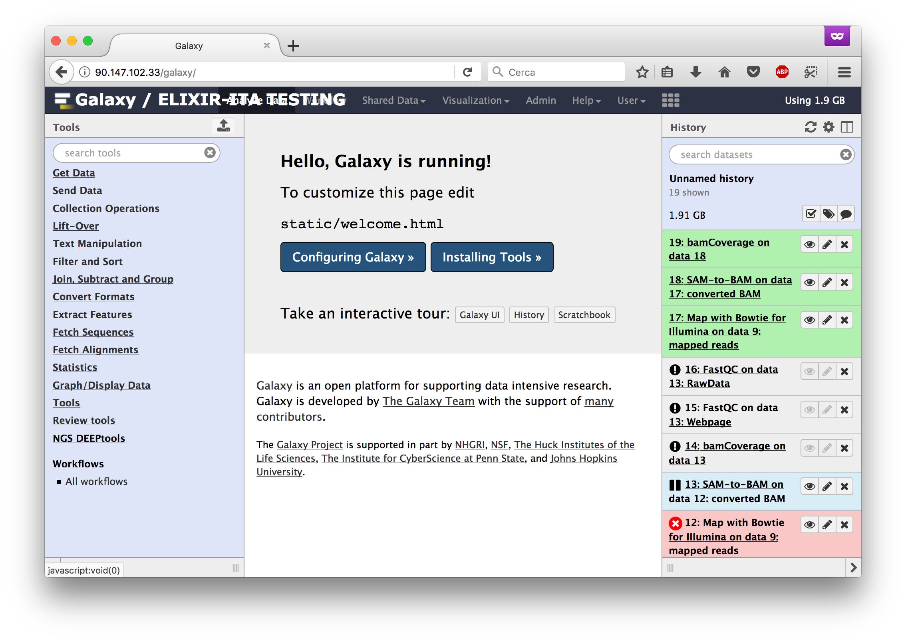

Frequently Asked Questions
==========================
Laniakea FAQs.

Recover Galaxy after Virtual Machine reboot
-------------------------------------------
How to correctly restart Galaxy after a reboot of the Virtual Machine ?

After the boot procedure of your VM at least these services should already be up and running:

#. PostgreSQL

#. Proftpd

#. NGINX 

Trying to connect to your Galaxy instance IP with a web browser you should see:

.. _unlock_encrypted_storage:

Step 1: Unlock encrypted storage
********************************
If your instance is not mounted on encrypted storage please skip this and go to :ref:`one_command_procedure`

To unlock the volume connect with SSH and type the command ``sudo /usr/local/bin/luksctl open`` followed by your passphrase.

::

  $ sudo /usr/local/bin/luksctl open
  Enter passphrase for /dev/disk/by-uuid/4ba96890-f914-46aa-b7a6-7e71f0846f43: 

  Name:              jzwoejuw
  State:             ACTIVE
  Read Ahead:        8192
  Tables present:    LIVE
  Open count:        1
  Event number:      0
  Major, minor:      252, 0
  Number of targets: 1
  UUID: CRYPT-LUKS1-4ba96890f91446aab7a67e71f0846f43-jzwoejuw

  Encrypted volume: [ OK ]

.. _one_command_procedure:

Step 2: One-command procedure
*****************************

If you did not change Instance user permissions you can just copy and paste this: 

::

  $ wget -O - https://raw.githubusercontent.com/Laniakea-elixir-it/Scripts/master/galaxy/recover.sh | bash

  Probing /cvmfs/elixir-italy.galaxy.refdata... OK
  Contacting Galaxy (wait for 10 seconds)...
  Galaxy server on-line: [ OK ]

Advanced Step-by-step procedure
*******************************

.. Warning::

   Please follow this instructions only if you know what you are doing!

Mount reference data
++++++++++++++++++++

After encrypion storage unlock (see section :ref:`unlock_encrypted_storage`), if you have it, you need now to mount your reference datasets:

::

  $ sudo systemctl restart autofs

::

  $ sudo cvmfs_config killall

  Terminating cvmfs_config processes... OK
  Terminating cvmfs2 processes... OK
  Unmounting stale mount points... OK
  Cleaning up run-time variable data... OK
  Reloading autofs... OK

::

  $ sudo cvmfs_config probe

  Probing /cvmfs/elixir-italy.galaxy.refdata... OK

Start Galaxy
++++++++++++

Finally, to correctly start all Galaxy services run: ``sudo /usr/local/bin/galaxy-startup``

::

  $ sudo /usr/local/bin/galaxy-startup 

  Loading Galaxy environment
  Exporting environment variables
  Check if galaxy is up and running, to avoid unuseful restart
  status: 502
  Galaxy unreachable
  Check is supervisord is running
  Starting the Galaxy production environment
  /usr/lib/python2.7/site-packages/supervisor/options.py:383: PkgResourcesDeprecationWarning: Parameters to load are deprecated.  Call .resolve and .require separately.
  return pkg_resources.EntryPoint.parse("x="+spec).load(False)

  Galaxy start: [ OK ] 

