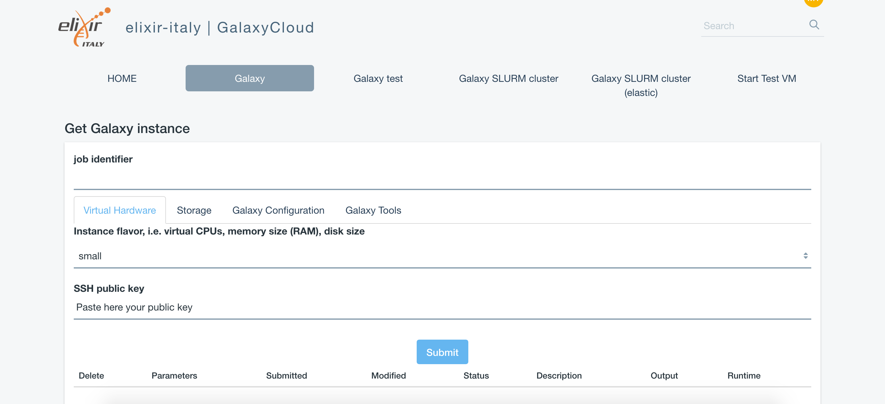

Authentication
==============

Currently, the authentication system relies on INDIGO-AAI.

To login into the portal, select the ``Sign in`` section on top-right:

.. figure:: _static/auth/auth_SignIn.png
   :scale: 50 %
   :align: center
   :alt: FGW Sign In

Then the ``Sign In`` pop-up window is displayed.

.. figure:: _static/auth/auth_SignInWindow.png
   :scale: 40 %
   :align: center
   :alt: FGW login pop-up

Insert your credentials.

To login using INDIGO-AAI, select the bottom-left option ``INDIGO AAI``:

.. figure:: _static/auth/auth_Login.png 
   :scale: 30 %
   :align: center
   :alt: Select login method

then login using your credential.

Finally, you can access the portal sections:

.. figure:: _static/auth/auth_FGWportal.png
   :scale: 25 %
   :align: center
   :alt: FGW portal

and instantiate Galaxy:

