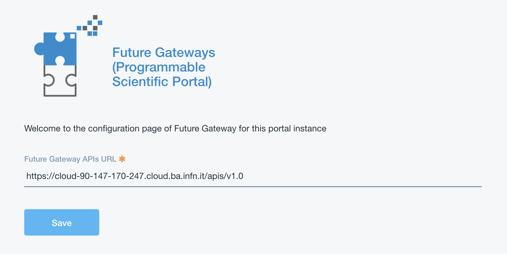
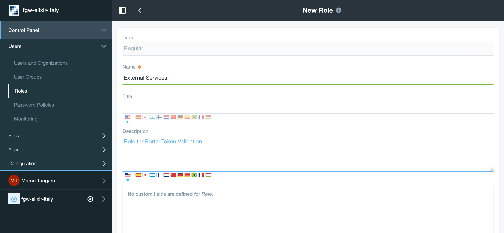
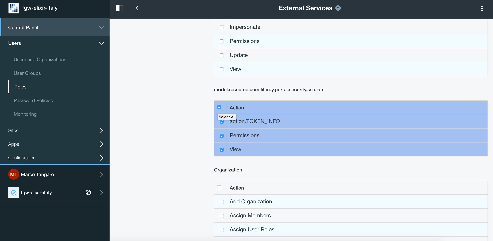
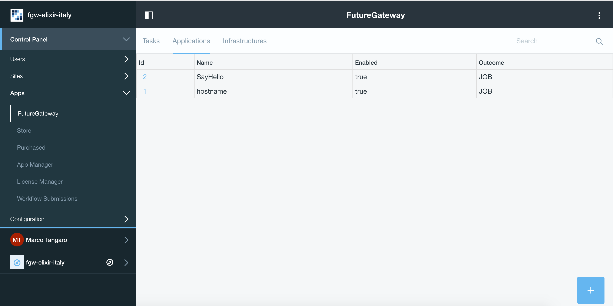

INDIGO FutureGateway
====================

.. Warning::

   FutureGateway deployment requires ``https`` and ``java 8``. Currently the script exploits ``openjdk 7``. Se section `Update to Java 8 - Appendix A`_.

To correctly setup the FGW portal follow the instruction in the ``Ubuntu LTS 14.04 Server`` section `here <https://indigo-dc.gitbooks.io/futuregateway/content/installation.html>`_ as super user:

::

  # IP=$(ifconfig | grep  -A 2 eth0 | grep inet\ addr | awk -F':' '{ print $2 }' | awk '{ print $1 }' | xargs echo)

  # echo "$IP    futuregateway" >> /etc/hosts

  # adduser --disabled-password --gecos "" futuregateway

  # mkdir -p /home/futuregateway/.ssh

  # chown futuregateway:futuregateway /home/futuregateway/.ssh

  # wget https://github.com/indigo-dc/PortalSetup/raw/master/Ubuntu_14.04/fgSetup.sh

  # chmod +x fgSetup.sh

  # cat /dev/zero | ssh-keygen -q -N ""

  # cat /root/.ssh/id_rsa.pub >> /home/futuregateway/.ssh/authorized_keys

  # echo "#FGSetup remove the following after installation" >> /etc/sudoers

  # echo "ALL  ALL=(ALL) NOPASSWD:ALL" >> /etc/sudoers

You can edit the fgSetup.sh script to point to specific FGW release or branch. 

We are currently using ``master`` branch.

::

  GITBASE=https://github.com/indigo-dc                   # GitHub base repository endpoint
  GITBASERAW=https://raw.githubusercontent.com/indigo-dc # GitHub base for raw content
  GITPORTALSETUP_NAME="PortalSetup"                      # PortalSetup git path name
  GITPORTALSETUP_CLONE="PortalSetup.git"                 # PortalSetup clone name
  GITPORTALSETUP_TAG="master"                            # PortalSetup tag name
  GITFGAPISERVER_NAME="fgAPIServer"                      # fgAPIServer git path name
  GITFGAPISERVER_CLONE="fgAPIServer.git"                 # fgAPIServer clone name
  GITFGAPISERVER_TAG="master"                            # fgAPIServer tag name
  GITFGAPISERVERDAEMON_NAME="APIServerDaemon"            # APIServerDaemon git path name
  GITFGAPISERVERDAEMON_CLONE="APIServerDaemon.git"       # APIServerDaemon clone name
  GITFGAPISERVERDAEMON_TAG="master"                      # APIServerDaemin clone tag name  

Then:

::

  # ./fgSetup.sh futuregateway futuregateway <your ssh port> $(cat /root/.ssh/id_rsa.pub)

The ssh port is, usually, the ``22``.

.. Warning::

  FutureGateway token authentication requires ``https``. Here, we are going to use Let's Encrypt certificates, as examble. A quick guide is available `here <https://github.com/maricaantonacci/slam/blob/master/gitbook/create-custom-keystore.md>`_.

Portal configuration
--------------------

Start the portal:

::

  # /etc/init.d/futuregateway start

The portal will available at http(s)://<your_ip_address>:8080

.. Note::

   FGW (re)start take a while!

Login with the mail configured during the wizard and ``test`` as password. Then set your new password and recovery question.

Apache configuration
--------------------

https is mandatory for FutureGateway Token authentication.

Enalble http_proxy and ssl modules on apache2

::

  a2enmod ssl
  a2enmod proxy_http

Port ``443`` must be opened.

In ``/etc/apach2/sites-available/`` create your `futuregateway.conf <https://raw.githubusercontent.com/mtangaro/fgw-elixir-italy/master/configs/futuregateway.ssl.conf>`_ file, setting

::

  ServerName <your_server_name>

  ...

  ## SSL directives
  SSLEngine on
  SSLCertificateFile /path/to/cert.pem
  SSLCertificateKeyFile /path/to/key.pem
  SSLCertificateChainFile /path/to/chain.pem

  ...

then enable FGW:

::

  a2ensite futuregateway.conf

and reload apache:

::

  # service apache2 reload

Add to FGW configuration file ``portal-ext.properties`` the following lines:

::

  web.server.protocol=https
  web.server.https.port=443

and restart FGW:

::

  # /etc/init.d/futuregateway restart

.. Note::

   To create your signed cetificate with Let's Encrypt: https://github.com/maricaantonacci/slam/blob/master/gitbook/create-custom-keystore.md

IAM integration
---------------

Iam portlets for the FGW portal are available on github: https://github.com/mtangaro/fgw-elixir-italy/tree/master/iam-modules

Put the portlets in the ``/home/futuregateway/FutureGateway/deploy/``, FGW will upload them automatically, moving them in ``/home/futuregateway/FutureGateway/osgi/modules/``.

You can follow this instructions to set it up: https://github.com/indigo-dc/LiferayPlugIns/blob/master/doc/admin.md.

The option ``javascript.fast.load=false`` has to be set in ``/home/futuregateway/FutureGateway/portal-ext.properties``.

Administrator portlet
---------------------

The administrator portlet is here: https://github.com/mtangaro/fgw-elixir-italy/tree/master/admin-modules

Once uploaded, the Future Gateway APIs URL is ``https://hostname/apis/v1.0``.

The next thing is the configuration of PTV (Portal Token Validator). This is a service which FG API server uses for token validation.

Specific Liferay user and role are needed to exploit PTV.

.. Note::

   This step is not mandatory, since you can still configure your portal owner for token validation, since it has all required permissions and is registerd to IAM.

   But, if you change IAM client you have to create a new user and change the PTV configuration. This configuration avoid this.

Create a new Role named ``External Services`` and give it IAM token permissions:

Create a new user (not a IAM user, just register it using the Sign-in liferay module and enable it).

Then assign the new Role ``External Services`` to the new user: Users and Organizations -> User Information -> Roles -> Select ``External Services`` and save.

To configure PTV you have to modify ``FutureGateway/fgAPIServer/fgapiserver.conf`` [1] by the following options:

::

  fgapisrv_ptvendpoint= https://hostname/api/jsonws/iam.token/get-token-info
  fgapisrv_ptvuser    = [...]
  fgapisrv_ptvpass    = [...]

Moreover you have to configure ``FutureGateway/apache-tomcat-8.0.36/webapps/APIServerDaemon/WEB-INF/classes/it/infn/ct/ToscaIDC.properties`` [2] with:

::

  fgapisrv_frontend   = https://hostname/apis/v1.0
  fgapisrv_ptvtokensrv= https://hostname/api/jsonws/iam.token/get-token
  fgapisrv_ptvendpoint= https://hostname/api/jsonws/iam.token
  fgapisrv_ptvuser    = [...]
  fgapisrv_ptvpass    = [...]

ptvuser and ptvpass corresponds to user email and password of a FGW user with the right permissions for token validations.

.. Warning::

   After changing [1] restart of Apache ``# service apache2 restart``, and after [2] restart of Tomcat ``# service futuregateway restart``.

To validate if your PTV service is working, you can do the following:

#.  Visit https://jwt.io and copy-paste your IAM token. Token is stored in Your User Name -> Account Settings -> Miscellaneus ->  Iamaccesstoken

    .. figure:: _static/fgw/iamaccesstoken.png
       :scale: 30 %
       :align: center
       :alt: IAM access token

    In the decoded payload, you will find your subject:

    ::    
    
      321f0ea3-4aab-46f7-accf-f645cd9d3629

#.  Use the PTV web service directly:

    ::

      $ export PTV_USER= ***
      $ export PTV_PASS= ***
      $ export SUBJECT=321f0ea3-4aab-46f7-accf-f645cd9d3629

      $ curl -u "$PTV_USER:$PTV_PASS"\
             -d "subject=$SUBJECT"\
             https://hostname/api/jsonws/iam.token/get-token

To test if the FGW API server is authenticating you correctly, you can do the following:

::

  $ curl https://hostname/apis/v1.0/applications

This should show '401 Unauthorized', so do the following:

::

  export TOKEN = IAM_token_from_FGW_portal

  $ curl -H "Authorization: Bearer $TOKEN" https://hostname.cloud.ba.infn.it/apis/v1.0/applications

If FG API server is configured correctly, you will get JSON description of your FG applications.

Finally, going in the FutureGateway admin portlet you should see:

Portlet configuration
---------------------

Create build environment
~~~~~~~~~~~~~~~~~~~~~~~~

To correctly build FutureGateway portlets we recommends to use ``Ubuntu 16.04``
``Java 8`` and ``gradle`` are needed:

::

  # apt-get install gradle

Install Blade cli: https://dev.liferay.com/develop/tutorials/-/knowledge_base/7-0/installing-blade-cli

The linux version of the liferay portal is available here: https://sourceforge.net/projects/lportal/files/Liferay%20Workspace/1.5.0.1/LiferayWorkspace-1.5.0.1-linux-x64-installer.run

::

  $ chmod +x LiferayWorkspace-1.5.0.1-linux-x64-installer.run

  $ ./LiferayWorkspace-1.5.0.1-linux-x64-installer.run

Answer ``[2] Don't initialize Liferay Workspace directory``

and continue the installation.

Build portlets
~~~~~~~~~~~~~~

Next you should use some code lines like below:

::

  blade init liferay-workspace

  cd ./liferay-workspace

  git clone https://github.com/indigo-dc/LiferayPlugIns modules/

  cd ./modules

  git checkout remotes/origin/nonofficial # to build nonofficial portlets

  blade gw clean jar

Newly created portlets are in ./modules/LIB_NAME/build/libs.

Next you need copy created jars to ~/FutureGateway/deploy and portlets are available on the your website.

.. _java_anchor:

Update to Java 8 - Appendix A
------------------------------

::

  sudo apt-get purge openjdk*

  sudo add-apt-repository ppa:webupd8team/java

  sudo apt-get update

  sudo apt-get install oracle-java8-installer

log-out and log-in to refresh environment variables.

Configure Apache for http - Appendix B
--------------------------------------

Enalble http_proxy on apache2

::

  a2enmod proxy_http

In ``/etc/apach2/sites-available/`` create your `futuregateway.conf <https://raw.githubusercontent.com/mtangaro/fgw-elixir-italy/master/configs/futuregateway.conf>`_ file, setting

::

  ServerName <your_serve_name>

  ...

then enable FGW:

::

  a2ensite futuregateway.conf

and reload apache:

::

  # service apache2 reload

Import Signed CA - Appendix C
-----------------------------
To import the SSL certificate you have to

#. Install the ca-certificates package:
   
   ::

     # yum install ca-certificates

#. Add the certificate as a new file to

   ::

     # cp path/to/goagent/local/CA.crt /usr/local/share/ca-certificates/cert.crt

#. Use command:

   ::

     # update-ca-certificates

Import Signed CA in Java keystore - Appendix D
----------------------------------------------
If IAM is under https but Tomcat log (``$CATILINA_HOME/webapps/APIServerDaemon/WEB-INF/logs/APIServerDaemon.log``) is showing:

::

  ...
  23:03:55,675 ERROR [http-nio-8080-exec-13][IAMEndPoints:69] IAM Configuration URL 'https://indigoiam.cloud.ba.infn.it/.well-known/openid-configuration' is not reachable
  ... 

you have to import your https certificate in java keystore [*]:

::

  # apt-get install ca-certificates-java

  # keytool -import -file /path/to/crt/file/file.crt -storepass changeit -keystore $JAVA_HOME/lib/security/cacerts -alias mycert

To list java certificates:

::

  $ keytool -list -storepass changeit -keystore $JAVA_HOME/lib/security/cacerts

You can install it in ``/etc/ssl/certs`` to make curl work, too.

[*] http://www.thinkplexx.com/learn/howto/security/tools/understanding-java-keytool-working-with-crt-files-fixing-certificate-problems

Create https certificate - Appendix E
-------------------------------------
You can install the certbot tool on your machine (1st approach) or you can use the docker image certbot/certbot (2nd approach).

::
  
  Install certbot tool (https://certbot.eff.org/#ubuntuxenial-other)
  $ sudo apt-get install software-properties-common
  $ sudo add-apt-repository ppa:certbot/certbot
  $ sudo apt-get update
  $ sudo apt-get install certbot
  $ sudo certbot certonly --standalone -d $HOSTNAME

  The certificates should be in:
  $ sudo ls /etc/letsencrypt/live/$HOSTNAME
  cert.pem  chain.pem  fullchain.pem  privkey.pem  README
  
or

::

  $ sudo docker run -it --rm -p 80:80 -p 443:443 -v /etc/letsencrypt:/etc/letsencrypt/  certbot/certbot certonly --standalone -d $HOSTNAME
  The certificates should be in:
  $ sudo ls /etc/letsencrypt/live/$HOSTNAME
  cert.pem  chain.pem  fullchain.pem  privkey.pem  README

Fix ghost deployment issue
---------------------------
Open mysql FGW database:

::

  mysql -h localhost -P 3306 -u fgapiserver -pfgapiserver_password fgapiserver

  mysql> select f1.id, f2.id, f1.name from fg_user f1 join fg_user f2 on f1.name = f2.name where f1.id <> f2.id;
  +----+----+--------------------------------------+
  | id | id | name                                 |
  +----+----+--------------------------------------+
  |  6 |  5 | c0b907df-43a3-4c8a-952a-2b5ca56ec43e |
  |  5 |  6 | c0b907df-43a3-4c8a-952a-2b5ca56ec43e |
  |  8 |  7 | 9c3c7f53-7279-4008-82be-60600418c884 |
  |  7 |  8 | 9c3c7f53-7279-4008-82be-60600418c884 |
  +----+----+--------------------------------------+
  4 rows in set (0.00 sec)

Suppose you want to delete user `id = 6`, which is showing you double entries (note that in this particular case we deleted both `id=6` and `id=8` which were our double entries, keeping `id=5` and `id=7`):

::

  mysql> delete from fg_user_group where user_id = 6;
  Query OK, 1 row affected (0.04 sec)

  mysql> delete from fg_user where id=6;
  Query OK, 1 row affected (0.01 sec)

Then you can add unique contraint to prevent double entries:

::

  mysql> alter table fg_user add unique(name);
  Query OK, 0 rows affected (0.50 sec)
  Records: 0  Duplicates: 0  Warnings: 0

Logs
----
You can easily access to logs with symlinks:

::

  ln -s /home/futuregateway/FutureGateway/apache-tomcat-8.0.36/webapps/APIServerDaemon/WEB-INF/logs/APIServerDaemon.log logs-apiserverdaemon.log
  ln -s /home/futuregateway/FutureGateway/fgAPIServer/fgapiserver.log logs-fgapiserver.log
  ln -s /home/futuregateway/FutureGateway/apache-tomcat-8.0.36/logs/catalina.out logs-tomcat-catalina.out

References
----------

GitBook: https://www.gitbook.com/book/indigo-dc/futuregateway/details
