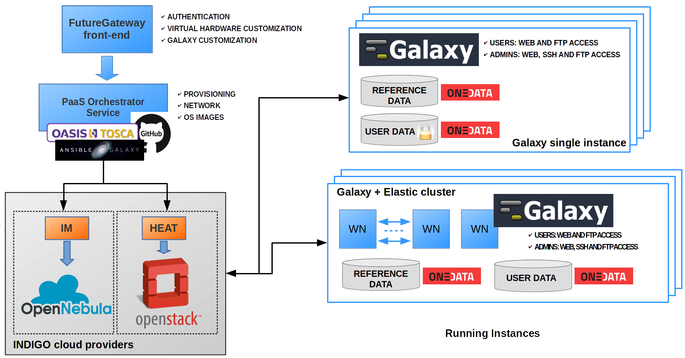

Service architecture
====================

The web front-end is designed to grant user friendly access to the service, allowing to easily configure and launch each Galaxy instance through the :doc:`indigo_fgw` portal.

   Galaxy as a Cloud Service architecture

All the required components to automatically setup Galaxy instances (Galaxy and all its companion software) are deployed using the :doc:`indigo_orchestrator` and the :doc:`indigo_im` services, based on the TOSCA orchestration language. The service is compatible with both OpenNebula and OpenStack, its deployment on different e-infrastructures. Moreover, it supports both VMs and Docker containers, leaving the selection of the virtual environment to the service providers. This effectively removes the need to depend on particular configurations (e.g. OpenStack, OpenNebula or other private cloud solution like Amazon or Google).

Persistent storage is provided to store users and reference data and to install and run new (custom) tools and workflows. Data security and privacy are granted through the INDIGO :doc:`indigo_onedata` component which, at the same time, allow for transparent access to the storage resources through token management. Data encryption implemented at file system level protects user’s data from any unauthorized access.

Automatic elasticity, provided using the :doc:`indigo_clues` service component, enables dynamic cluster resources scaling, deploying and powering-on new working nodes depending on the workload of the cluster and powering-off them when no longer needed. This provides an efficient use of the resources, making them available only when really needed.
