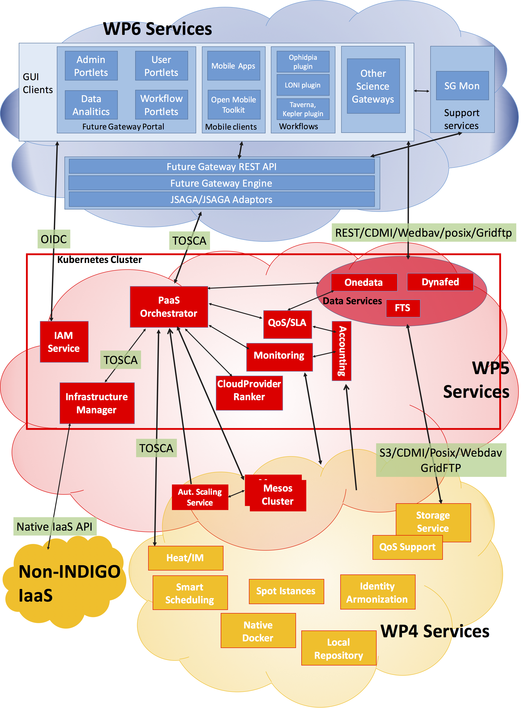
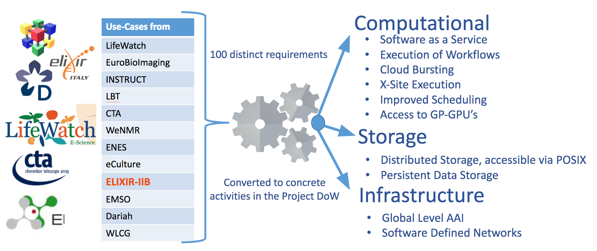
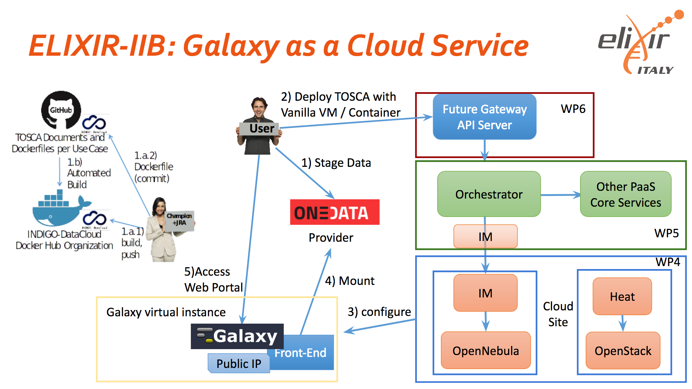
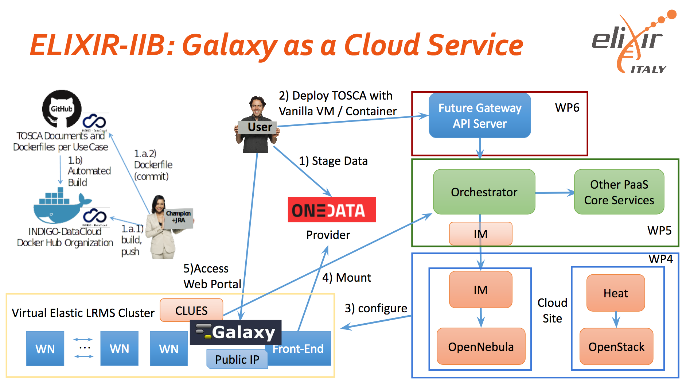

INDIGO-DataCloud
================

.. _fig_updateprocess:

.. figure:: _static/intro_indigo_logo.png
   :scale: 40 %
   :align: center
   :alt: INDIGO-DataCloud project logo

The **INDIGO-DataCloud** project (H2020-EINFRA-2014-2) aims to develop an open source computing and data platform, targeted at multi-disciplinary scientific communities, provisioned over public and private e-infrastructures.

In order to exploit the full capabilities of current cloud infrastructures, supporting complex workflows, data transfer and analysis scenarios, the INDIGO architecture is based on the analysis and the realization of use cases selected by different research communities in the areas of High Energy Physics, Bioinformatics, Astrophysics, Environmental modelling, Social sciences and others.

.. _fig_updateprocess:

   The INDIGO-DataCloud architecture

.. _fig_updateprocess:

   The INDIGO-DataCloud communities

INDIGO released two software release:

==============  ==============  ==========================
Release         Code name       URL
==============  ==============  ==========================
First release   MIDNIGHTBLUE    https://www.indigo-datacloud.eu/news/first-indigo-datacloud-software-release-out
Second release  ELECTRICINDIGO  https://www.indigo-datacloud.eu/news/electricindigo-second-indigo-datacloud-software-release 
==============  ==============  ==========================

The INDIGO-DataCloud releases provide open source components for:

#. **IaaS layer**: increase the efficiency of existing Cloud infrastructures based on OpenStack or OpenNebula through advanced scheduling, flexible cloud/batch management, network orchestration and interfacing of high-level Cloud services to existing storage systems.

#. **PaaS layer**: easily port applications to public and private Clouds using open programmable interfaces, user-level containers, and standards-based languages to automate definition, composition and embodiment of complex set-ups.

#. **Identity and Access Management**: manage access and policies to distributed resources.

#. **FutureGateway**: a programmable scientific portal providing easy access to both the advanced PaaS features provided by the project and to already existing applications.

#. **Data Management and Data Analytics Solutions**: distribute and access data through multiple providers via virtual file systems and automated replication and caching.

For a complete list of INDIGO-DataCloud services, please visit: https://www.indigo-datacloud.eu/service-component

The ELIXIR-IIB use case in INDIGO
---------------------------------
ELIXIR-IIB in the framework of the INDIGO-DataCloud project is developing a cloud Galaxy instance provider, allowing to fully customize each virtual instance through a user-friendly web interface, overcoming the limitations of others galaxy deployment solutions.
In particular, our goal is to develop a PaaS architecture to automate the creation of Galaxy-based virtualized environments exploiting the software catalogue provided by the INDIGO-DataCloud community.

#. All Galaxy required components automatically deployed (**INDIGO PaaS Orchestrator** and the **Infrastructure Manager**):

   - Galaxy
   - PostgreSQL
   - NGINX
   - uWSGI
   - Proftpd
   - Galaxy tools (from ToolShed)
   - Reference Data

#. User friendly access, allowing to easily configure and launch a Galaxy instance (**INDIGO FutureGateway portal**)

#. Authentication (**Identity and Access Management** and **FutureGateway**)

#. Persistent storage, data security and privacy (**Onedata** or IaaS block storage with filesystem encryption).

#. Cluster support with automatic elasticity (**INDIGO CLUES**).

.. _fig_updateprocess:

   ELIXIR-IIB use case in INDIGO architecture for single Galaxy instances deployment.

.. _fig_updateprocess:

   ELIXIR-IIB use case in INDIGO architecture for Galaxy with cluster support deployment

References
----------
INDIGO services: https://www.indigo-datacloud.eu/service-component
