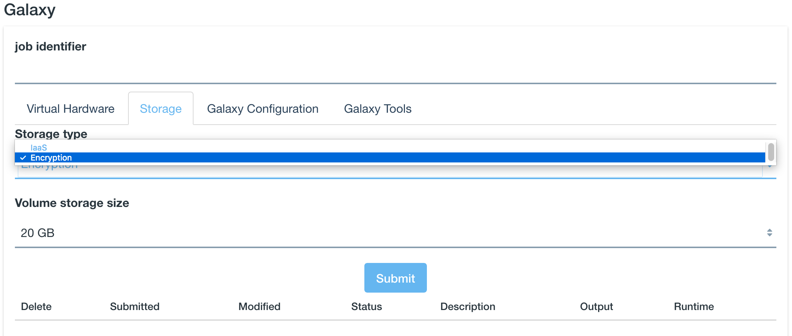
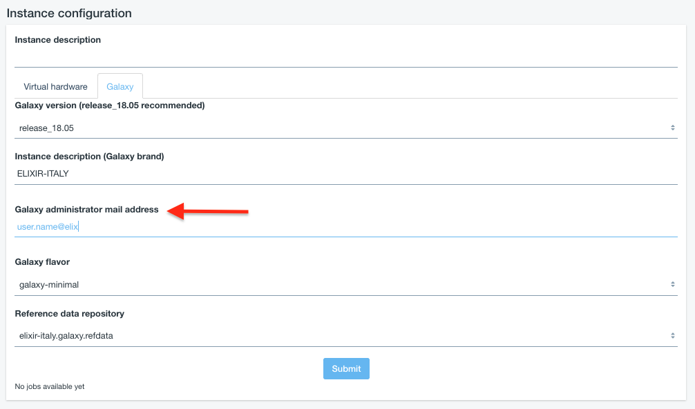
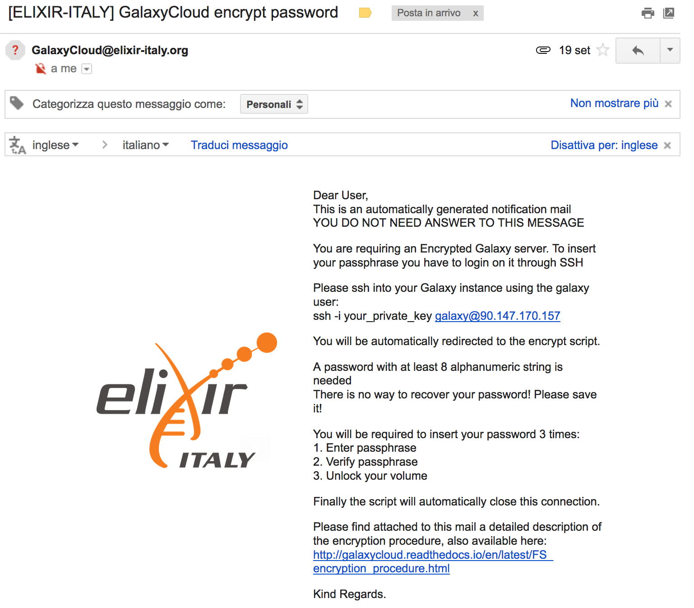

Get encrypted instance
======================

The service provides the possibility to encrypt the storage volume associated to the virtual machine on-demand.

.. Note::

   Only the external volume, where Galaxy data are stored, is encrypted, not the Virtual Machine root disk.

To encypt the external volume storage just select ``Encryption`` as ``Storage type`` in the ``Storage`` section. 
 

Cryptographic keys should never be transmitted in the clear. For this reason during Galaxy deployment user intervention is required.

Data privacy is granted through LUKS file system encryption: user will be required to insert a password to encrypt/decrypt data directly on the virtual instance during its deployment, avoiding any
interaction with the cloud administrator(s).

An e-mail is sent to the e-mail address configured in the ``Galaxy Configuration`` section.

.. Warning::

   Make sure you have entered a valid mail address!

The e-mail is sent you only when the system is ready to accept your password and contains all the instructions to correctly encrypt/decrypt your system. The e-mail subject is ``[ELIXIR-ITALY] GalaxyCloud encrypt password`` sent by ``GalaxyCloud@elixir-italy.org``

.. Warning::

   If you do not receive the e-mail, please check your spam folder.

.. figure:: _static/qs_encryption/qs_encryption_attachment.png 
   :scale: 30 %
   :align: center
   :alt: Galaxy encryption mail attachment

Once the e-mail is arrived you can follow the step by step guide to encrypt your volume: :doc:`FS_encryption_procedure`.

.. seealso::

   For a detailed descreption of all Web UI options see section: :doc:`feat_galaxy_custom`.
