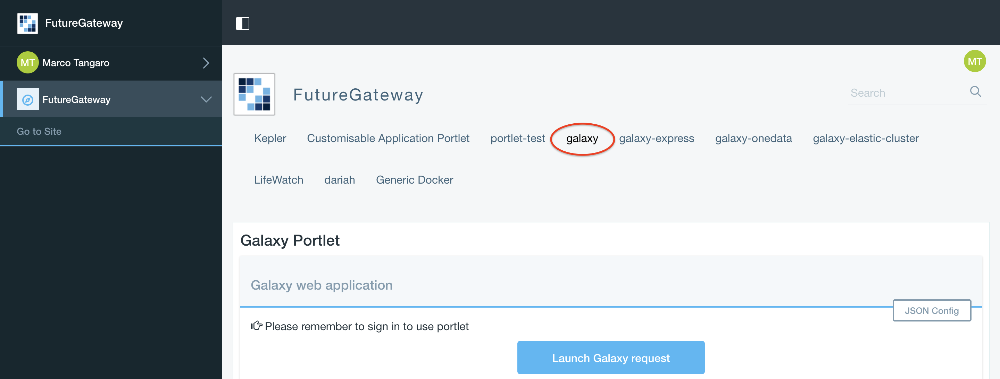
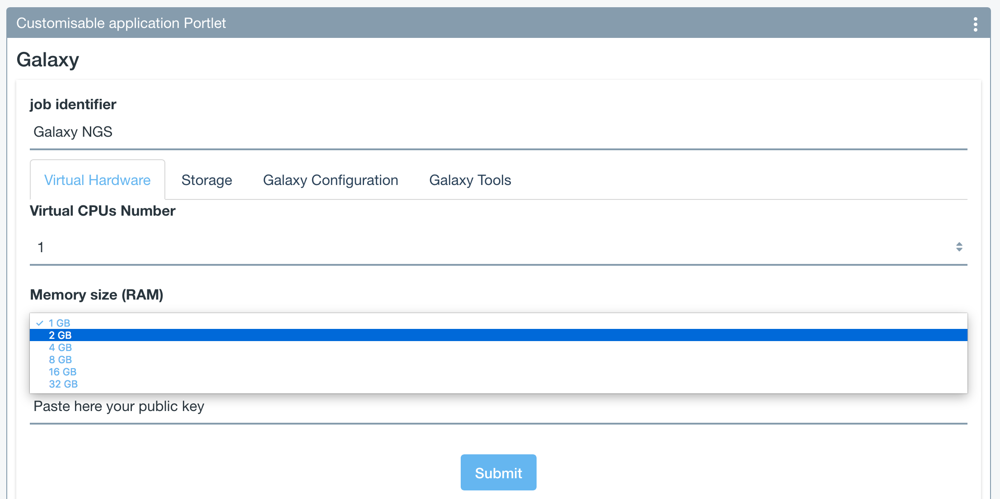
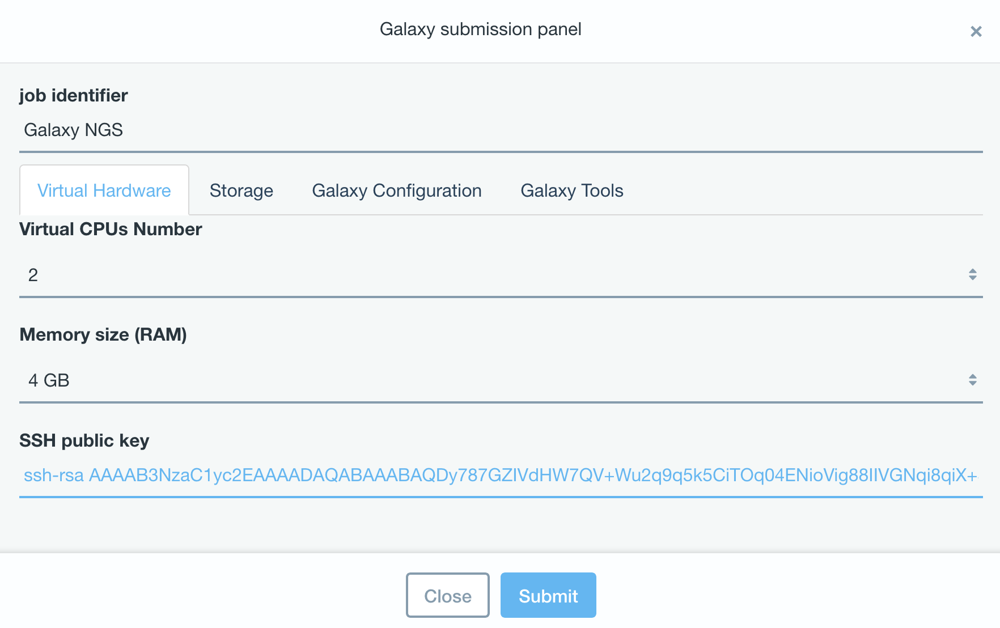
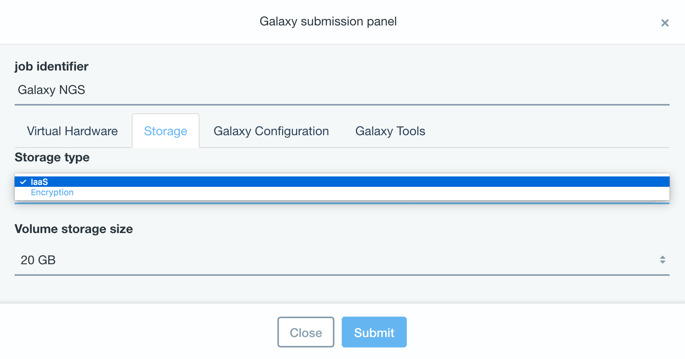
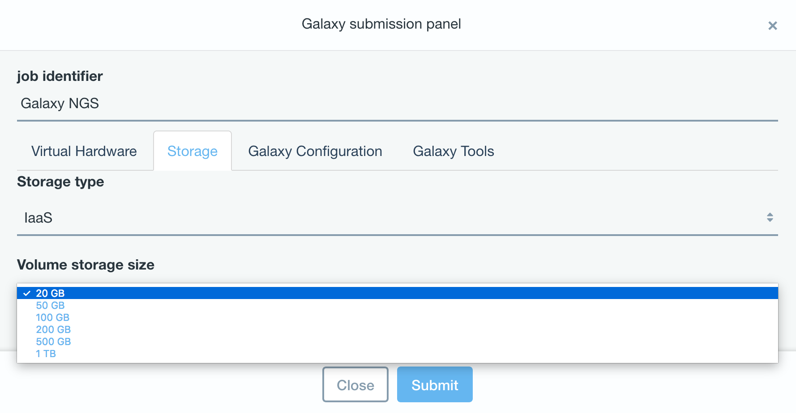
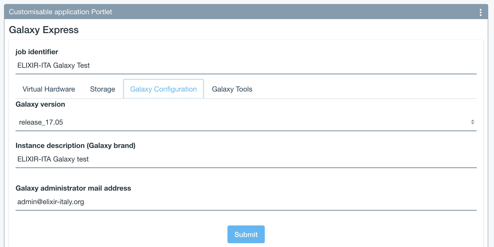
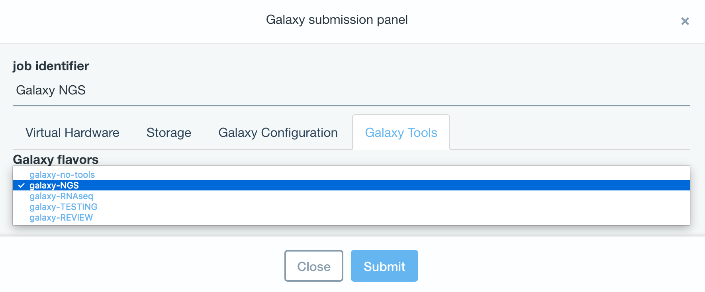

Get Galaxy
==========

Instantiate Galaxy
------------------

.. Note::

   For a detailed descreption of all Web UI options see section: :doc:`feat_galaxy_custom`.

.. Note::

   To login into the portal see section: :doc:`feat_authentication`.

.. Warning::

   VCPUS and Memory values selected by user have to match Image Flavor presets, otherwise a different flavor, as close as possible to the one selected, will be automatically assigned.
   Please read carefully the section: :doc:`qs_virtual_hdw_presets`.

Galaxy login
------------

The galaxy administrator password and the API key are automatically generated during the instatiation procedure and are the same for each instance:

::

  User: your user e-mail

  Password: galaxy_admin_password

  API key: ADMIN_API_KEY

.. Warning::

   Change Galaxy password and the API key as soon as possible!
