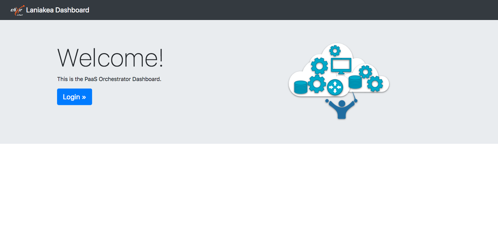
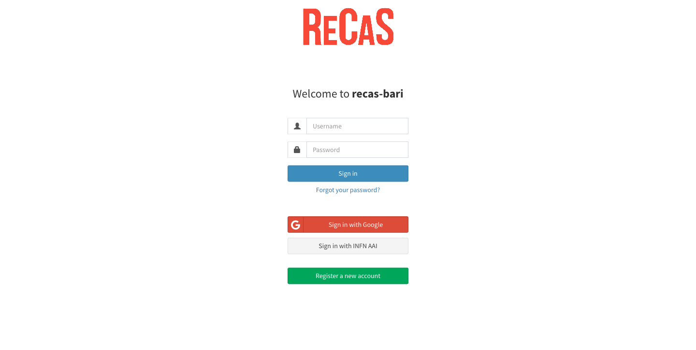
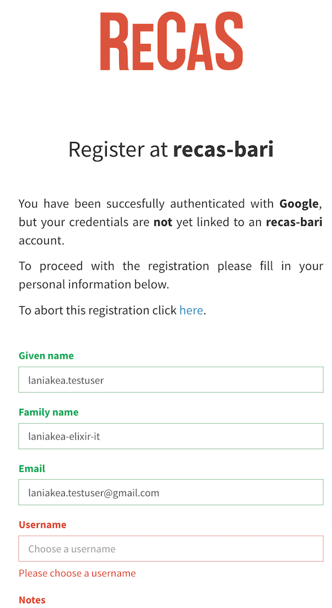
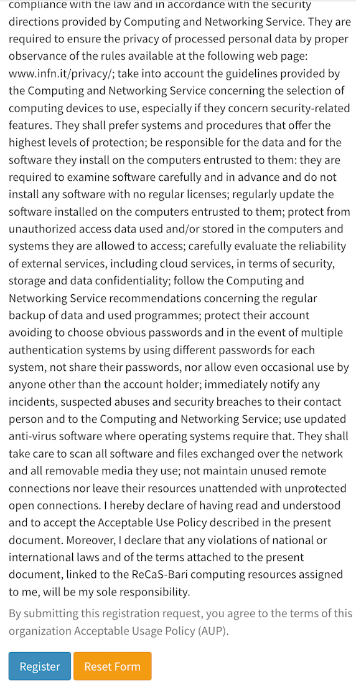
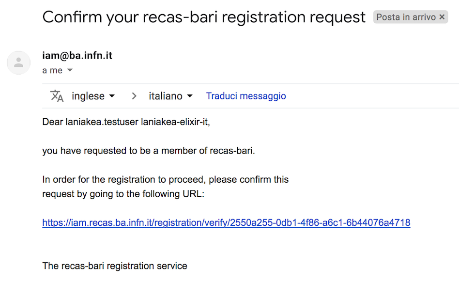
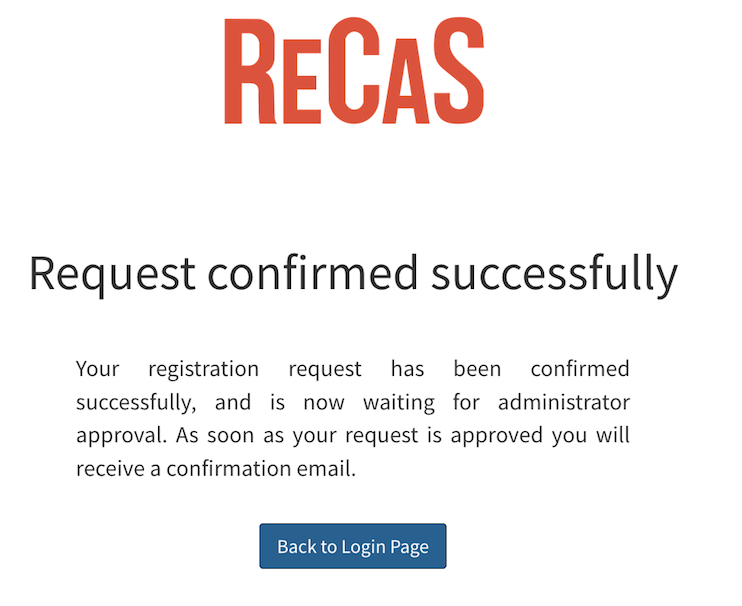
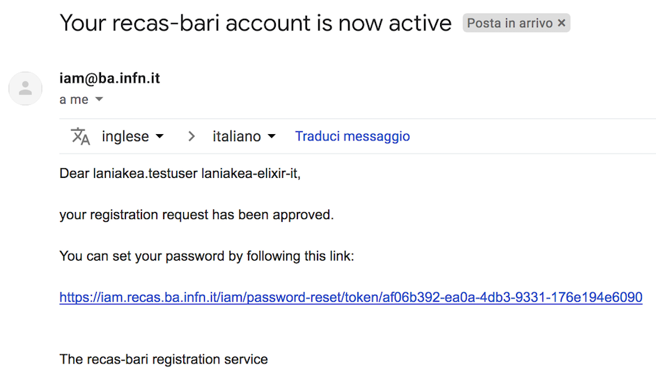
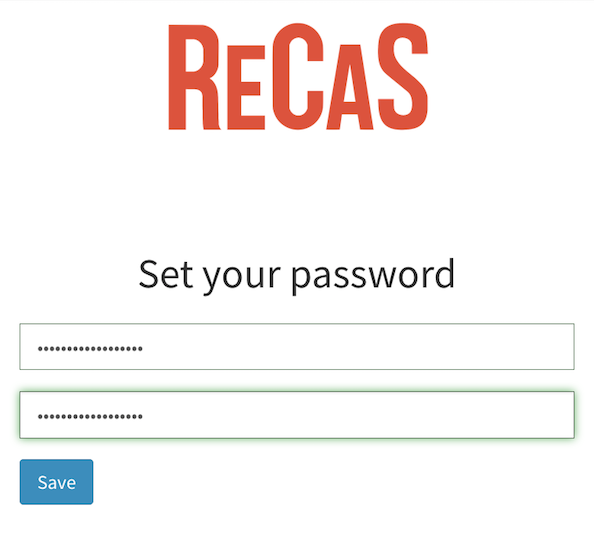
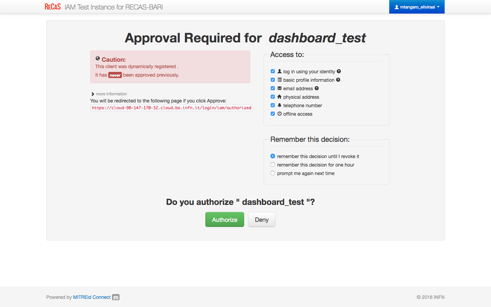
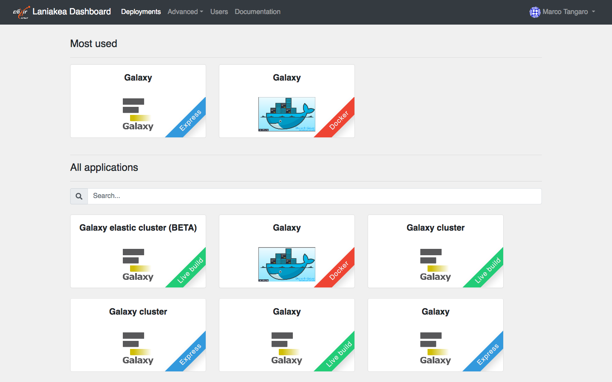

Authentication
==============

Currently, the authentication system relies on INDIGO-AAI.

To login into the portal, select the ``Sign in`` section on top-right:

Registration
------------
It is needed to register to the portal at the first login. Register with your preferred username or using Google authentication.

Fill the registration form using a valid e-mail address:

and accept the usage policy to complete the registration:

A confirmation e-mail is the sent your e-mail address:

.. figure:: img/registration/confirmation_alert.png
   :scale: 50 %
   :align: center
   :alt: confirmation alert

You don't need to answer to this mail, just follow the instructions, going to the link in the e-mail.

Once confirmed, your request has to be approved by the site administrators. This usually does not require too much time.

Once your request is approved, you will be notified by mail and asked to insert your password.

.. figure:: img/registration/change_password_success.png
   :scale: 50 %
   :align: center
   :alt: change password success

Finally at the first login you have to allow the Laniakea portal to acquire your login information:

Login
-----
To login into the portal, select the ``Sign in`` section on top-right:

Then insert your credentials or login using another authentication provider, you used during the registratrion procedure, like Google.

Finally, you can access the dashboard and instantiate Galaxy:

