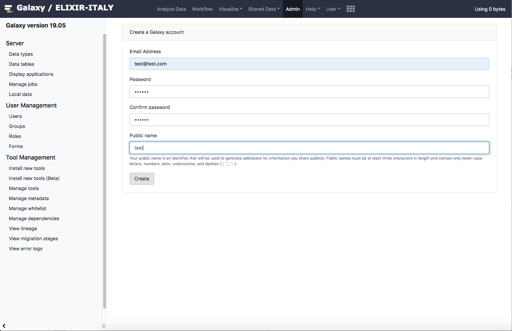
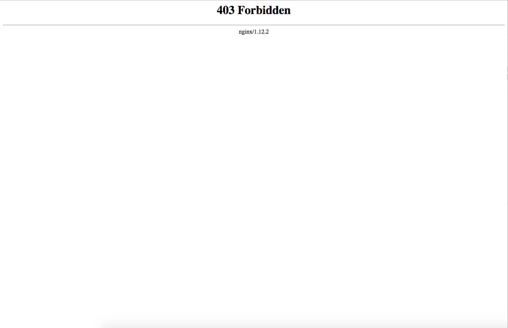
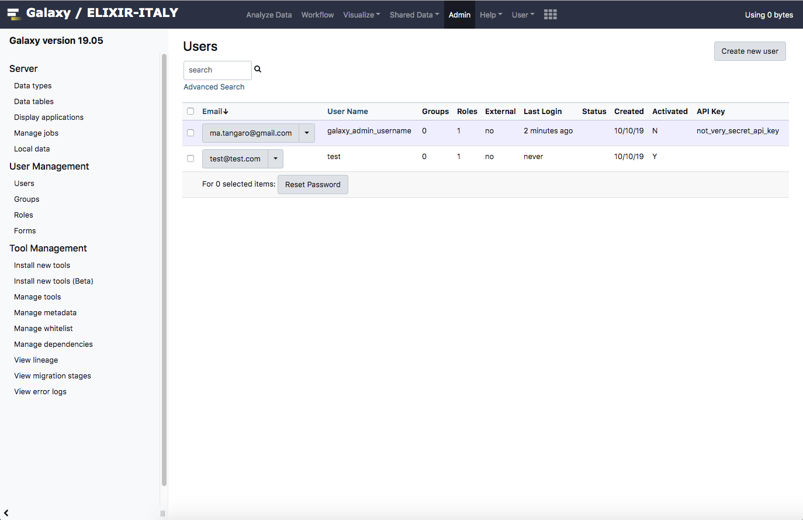

User creation error
-------------------

Anonymous login is disabled by default on Laniakea Galaxy instances. On Galaxy 19.05 there is a bug in the Admin section to create the user.

.. note::

   Only Galaxy 19.05 is affected.

Once you **create** the user, you will be redirect to the Admin panel. Currently, Galaxy is unable to set it correctly.

Actually, the user is correctly created and this is only redirect problem.

Galaxy is, in fact, wrongly redirecting you to http://<ip_address>/admin/users and not in the subpath http://<ip_address>/galaxy/admin/users. You need just to go on the Galaxy home page and then in the admin panel, to see the user created.
