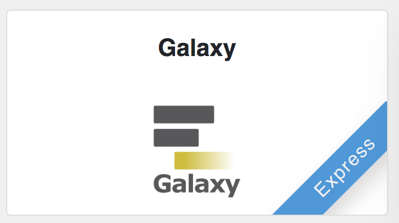
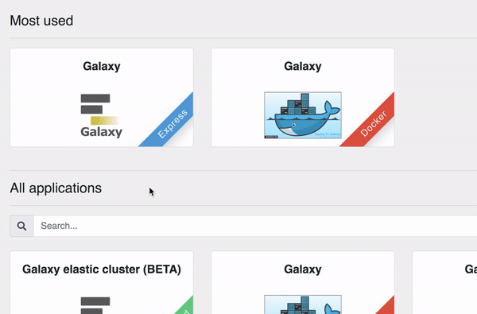
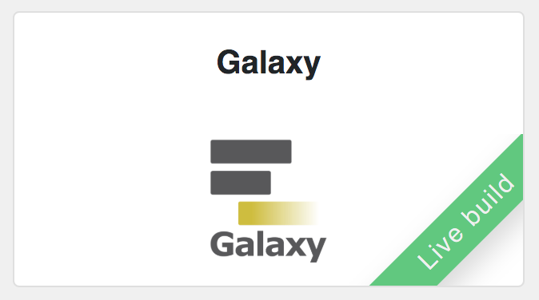
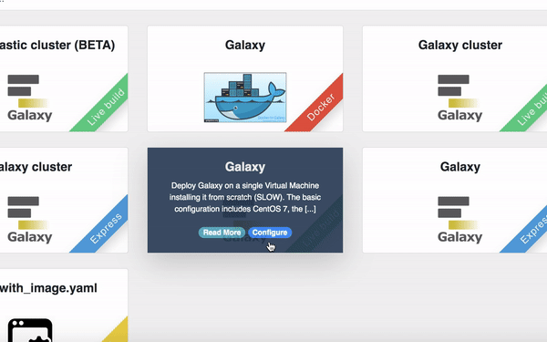
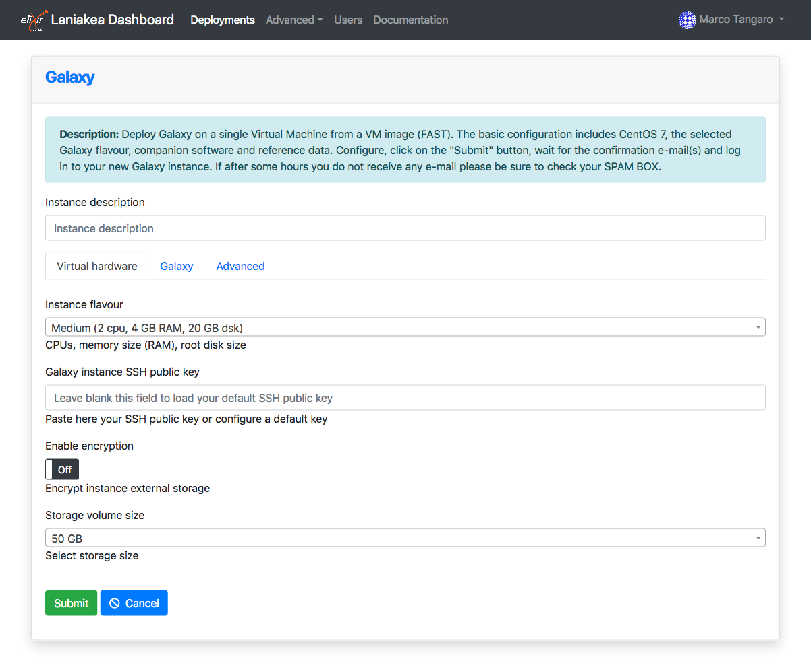
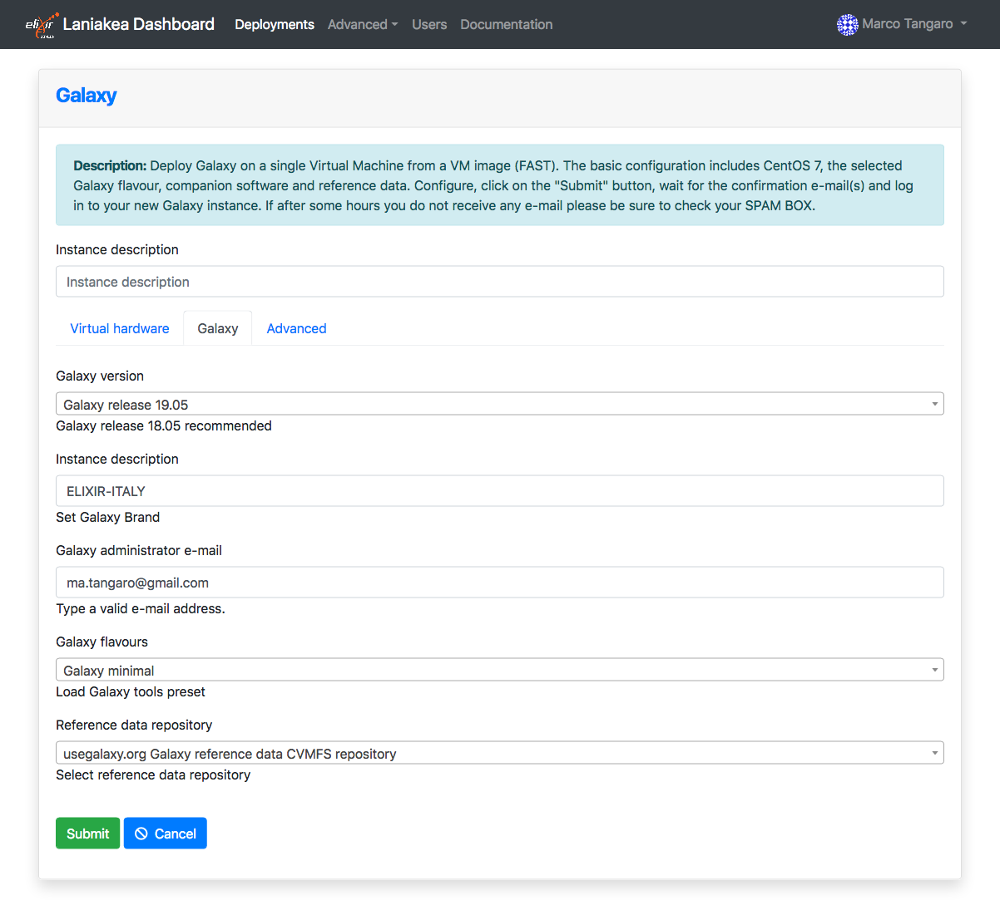

Get Galaxy 
==========

The Laniakea dashboard tiles allow user to deploy a standard `Galaxy production environment <https://docs.galaxyproject.org/en/latest/admin/production.html>`_ through two methods: |galaxy_vm| and |galaxy_latest|.

.. seealso::

   To login to Laniakea dashboard visit the section: :doc:`/user_documentation//authentication/authentication`.

|galaxy_vm| 
-----------

The |galaxy_vm| instantiate a CentOS 7 Virtual Machine with Galaxy, all its companion software and tools already embedded. Once deployed each Galaxy instance can be further customized with tools and reference data.

**This version is usually quite reliable and work well for most users.**

|galaxy_latest|
---------------

The |galaxy_latest| allows to setup and launch a virtual machine configured with the Operative System CentOS 7 and the auxiliary applications needed to support a Galaxy production environment such as PostgreSQL, Nginx, uWSGI and Proftpd and to deploy the Galaxy platform itself and the selected Galaxt tools.

This versione is recommended for those users which need an up-to-date system.

.. Warning::

   Everything is configured on the fly and, depending on the number of the tools to be installed may take time.

Instantiate Galaxy
------------------

Enter the |galaxy_vm| or |galaxy_latest| configuration section. The configuration options are the same.

Describe your instance using the ``Instance description`` field, which will identfy your Galaxy in the **Deployments page**, once your request is submitted.

Then the web front-end provides two different tabs for configuring the virtual hardware and the Galaxy instance.

Virtual hardware configuration
******************************

#. Select your instance flavour (virtual CPUs and the memory size). More information on available virtual hardware presets can be found here: :doc:`virtual_hdw_presets`.

#. Copy & Paste your SSH key, to login in the Galaxy instance or configure it in the :doc:`/user_documentation//ssh_keys/ssh_keys` page:

#. The service provides the possibility to encrypt the storage volume associated to the virtual machine on-demand, to protect user data.

   To enable storage encryption set to **ON** the switch.

   .. Warning::

      Only the external volume, where Galaxy data are stored, is encrypted, not the Virtual Machine root disk.

   The storage will be encrypted with a strong alphanumerical passphrase. More information on this topic can be found here:

   - :doc:`/user_documentation/encryption/manage_encrypted_instance`
   - :doc:`/admin_documentation/encryption/encryption`

#. Finally, it is possible to select the user storage volume size.

Galaxy configuration
********************

#. Select the Galaxy version, the instance administrator e-mail and the Galaxy brand tag (the top-left name in the Galaxy home page).

#. Provide a valid e-mail address as Galaxy administrator credential.

   .. note::

      A notification mail will be sent also to this e-mail address once the deployment is done.

#. Select Galaxy tools pre-set among those available (see section :doc:`galaxy_flavours`).

#. Select Galaxy reference dataset. The default should be the best choicne for most users (see section :doc:`galaxy_refdata`).

#. Finally, ``SUBMIT`` your request:

Galaxy login
------------

The galaxy administrator password and the API key are automatically set during the instatiation procedure and are the same for each instance:

::

  User: administrator e-mail

  Password: galaxy_admin_password

  API key: ADMIN_API_KEY

.. Warning::

   Change Galaxy password and the API key as soon as possible!

.. Warning::

   The anonymous login is by default disabled.
