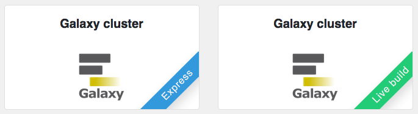
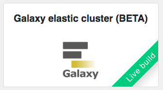
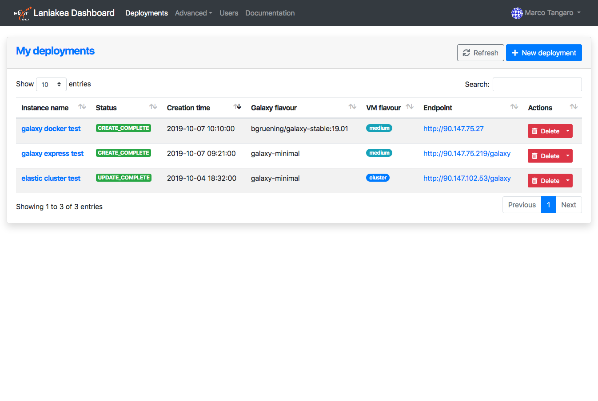

Launch |galaxy_cluster|
=======================

Galaxy serves tools which may require a wide range of computational resources to properly work. To account this, the Laniakea dashboard tiles allow user to deploy a standard `Galaxy production environment <https://docs.galaxyproject.org/en/latest/admin/production.html>`_ connected to a `compute cluster <https://galaxyproject.github.io/training-material/topics/admin/tutorials/connect-to-compute-cluster/tutorial.html>`_.

.. seealso::

   To login to the Laniakea dashboard visit the section: :doc:`/user_documentation//authentication/authentication`.

|galaxy_cluster|
----------------

The |galaxy_cluster| instantiate a Galaxy server and the worker nodes.

--------------------------
``Galaxy cluster Express``
--------------------------

The |galaxy_cluster| Express instantiate a CentOS 7 Virtual Machine with Galaxy, all its companion software and the set of tools that come with the selected flavour. Once deployed each Galaxy instance can be further customized with additional tools and reference data.

**This version is usually quite reliable and work well for most users.**

-----------------------------
``Galaxy cluster Live Build``
-----------------------------

The |galaxy_cluster| Live Build allows to setup and launch a virtual machine configured with the Operative System CentOS 7 and the auxiliary applications needed to support a Galaxy production environment such as PostgreSQL, Nginx, uWSGI and Proftpd and to deploy the Galaxy platform itself and the tools that come with the selected flavour.

This version is recommended for those users which want to be sure to have the latest available version of each tool.

|galaxy_elastic_cluster|
------------------------

The |galaxy_elastic_cluster| section allows to deploy a Galaxy Server with automatic elasticity support for worker nodes deplyment. Automatic elasticity enables dynamic cluster resources scaling, deploying and powering on new working nodes depending on the workload of the cluster and powering-off them when no longer needed. This provides an efficient use of the resources, making them available only when really needed.

.. Warning::

   Currently, this feature is under beta testing. Galaxy and tools are installed on-the-fly starting from a bare CentOS 7 image. The whole process, i.e. install Galaxy and tools, may take time. We will soon add the possibility to exploit images with tools to speed-up the configuration

.. Warning::

   Each node takes 12 minutes or more to be instantiated. Therefore, the job needs the same time to start. On the contrary, if the node is already deployed, the job will start immediately.

Instantiate Galaxy
------------------

Enter the |galaxy_cluster| (Express or Live BUild) or |galaxy_elastic_cluster| configuration section. The configuration options are the same.

.. figure:: img/configure_virtual_hardware_cluster.png 
   :scale: 50 %
   :align: center

Provide a description for your instance using the ``Instance description`` field, which will identfy your Galaxy in the **Deployments page**, once your request is submitted.

Two panels allows to configure the virtual hardware and the Galaxy instance respectively.

Virtual hardware configuration
******************************

#. Select the instance flavour (virtual CPUs and the memory size) for your Front node, i.e. the Galaxy server. More information on available virtual hardware presets can be found here: :doc:`virtual_hdw_presets`.

#. Select the number of Virtual Worker Nodes of your Cluster and the instance flavor, (virtual CPUs and RAM) for each worker node. More information on available virtual hardware presets can be found here: :doc:`virtual_hdw_presets`.

#. Copy & Paste your SSH key, to login in the Galaxy instance or configure it in the :doc:`/user_documentation//ssh_keys/ssh_keys` page.

#. Laniakea provides the possibility to encrypt the storage volume associated with the virtual machine on-demand, to protect user data.

   To enable storage encryption set the switch to **ON** .

   .. Warning::

      Only the external volume where Galaxy data are stored is encrypted, not the Virtual Machine root disk.

   The storage will be encrypted with a strong alphanumerical passphrase. More information on this topic can be found here:

   - :doc:`/user_documentation/encryption/manage_encrypted_instance`
   - :doc:`/admin_documentation/encryption/encryption`

#. Finally, it is possible to select the user storage volume size.

Galaxy configuration
********************

.. figure:: img/configure_galaxy_cluster.png
   :scale: 50 %
   :align: center

#. Select the Galaxy version, the instance administrator e-mail and the Galaxy brand tag (the top-left name in the Galaxy home page).

#. Provide a valid e-mail address as Galaxy administrator credential.

   .. note::

      A notification mail will be sent to this e-mail address once the deployment is done.

#. Select the Galaxy flavour among those available (see section :doc:`galaxy_flavours`).

#. Select Galaxy reference dataset. The default should be the best choice for most users (see section :doc:`galaxy_refdata`).

#. Finally, ``SUBMIT`` your request.

Galaxy access
-------------

Once your Galaxy instance a confirmation e-mail is sent, to the Laniakea user and to the galaxy administrator email, if different, with the URL of Galaxy and user credentials.

.. Warning::

   If you don't receive the e-mail:

   #. Check you SPAM mail directory

   #. Chek mail address spelling

   #. Wait 15 minutes more.

The instance information are also available in the **Deployments** page of the dashboard:

The galaxy administrator password and the API key are automatically set during the instatiation procedure and are the same for each instance:

::

  User: administrator e-mail

  Password: galaxy_admin_password

  API key: ADMIN_API_KEY

.. Warning::

   Change the Galaxy password and API key as soon as possible!

.. Warning::

   The anonymous login is disabled by default.
