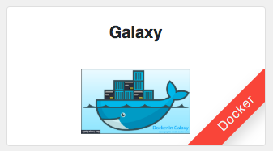
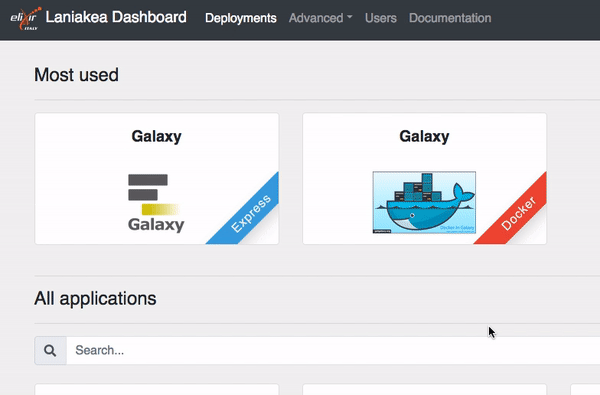
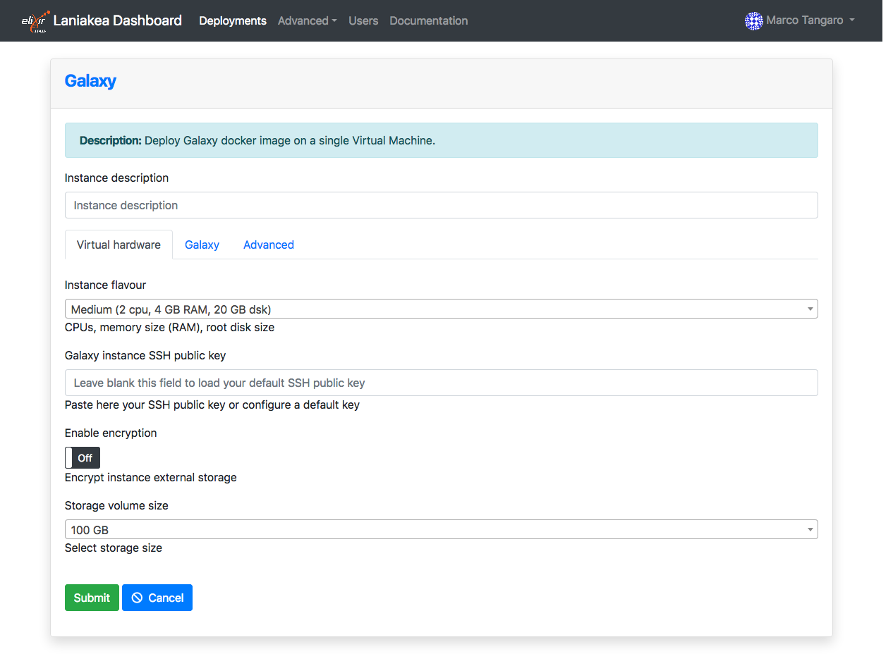
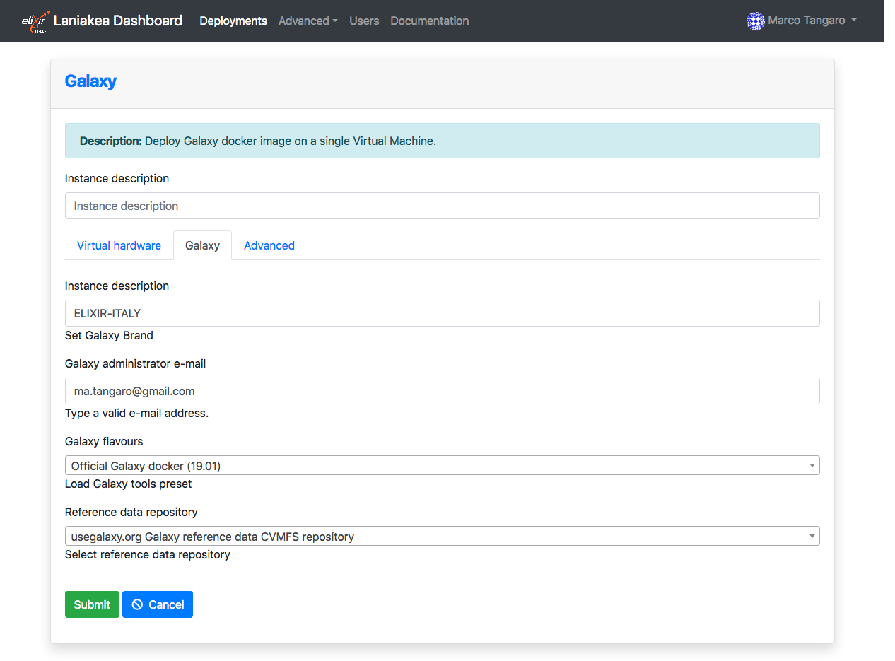

Launch |galaxy_docker| 
======================

The Laniakea dashboard tiles allow user to deploy Galaxy through its official `Docker image <https://github.com/bgruening/docker-galaxy-stable>`_.

.. seealso::

   To login to the Laniakea dashboard visit the section: :doc:`/user_documentation//authentication/authentication`.

The |galaxy_docker| instantiate an Ubuntu 16.04 Virtual Machine with the Galaxy official Docker. Once deployed each Galaxy instance can be further customized with additional tools and reference data.

Instantiate Galaxy
------------------

Enter the |galaxy_docker| configuration section.

Provide a description for your instance using the ``Instance description`` field, which will identfy your Galaxy in the **Deployments page**, once your request is submitted.

Two panels allows to configure the virtual hardware and the Galaxy instance respectively.

Virtual hardware configuration
******************************

#. Select your instance flavour (virtual CPUs and the memory size). More information on available virtual hardware presets can be found here: :doc:`virtual_hdw_presets`.

#. Copy & Paste your SSH key, to login in the Galaxy instance or configure it in the :doc:`/user_documentation//ssh_keys/ssh_keys` page.

#. Laniakea provides the possibility to encrypt the storage volume associated with the virtual machine on-demand, to protect user data.

   To enable storage encryption set the switch to **ON** .

   .. Warning::

      Only the external volume where Galaxy data are stored is encrypted, not the Virtual Machine root disk.

   The storage will be encrypted with a strong alphanumerical passphrase. More information on this topic can be found here:

   - :doc:`/user_documentation/encryption/manage_encrypted_instance`
   - :doc:`/admin_documentation/encryption/encryption`

#. Finally, it is possible to select the user storage volume size.

Galaxy configuration
********************

#. Select the instance administrator e-mail and the Galaxy brand tag (the top-left name in the Galaxy home page).

#. Provide a valid e-mail address as Galaxy administrator credential.

   .. note::

      A notification mail will be sent to this e-mail address once the deployment is done.

#. Select the Galaxy flavour among those available.

#. Select Galaxy reference dataset. The default should be the best choice for most users (see section :doc:`galaxy_refdata`).

#. Finally, ``SUBMIT`` your request.

Galaxy access
-------------

Once your Galaxy instance a confirmation e-mail is sent, to the Laniakea user and to the galaxy administrator email, if different, with the URL of Galaxy and user credentials.

.. Warning::

   If you don't receive the e-mail:

   #. Check you SPAM mail directory

   #. Chek mail address spelling

   #. Wait 15 minutes more.

The instance information are also available in the **Deployments** page of the dashboard:

.. figure:: img/deployments_page.png
   :scale: 50%
   :align: center

The galaxy administrator password and the API key are automatically set during the instatiation procedure and are the same for each instance:

::

  User: administrator e-mail

  Password: galaxy_admin_password

  API key: ADMIN_API_KEY

.. Warning::

   Change the Galaxy password and API key as soon as possible!

.. Warning::

   The anonymous login is disabled by default.

References
----------

`Official Galaxy Docker slides <https://galaxyproject.github.io/training-material/topics/admin/tutorials/galaxy-docker/slides.html#1>`_
