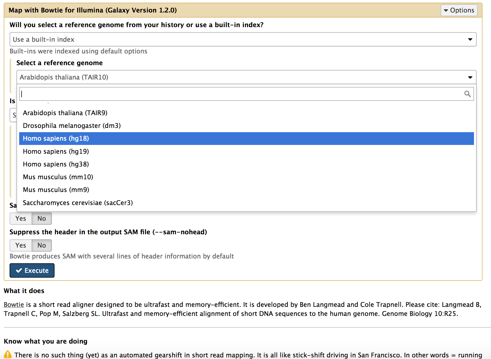

Reference Data
==============

Many Galaxy tools rely on the presence of reference data, such as alignment indexes or reference genome sequences, to efficiently work. A complete set of Reference Data, able to work with most common tools for NGS analysis is available for each Galaxy instance deployed.

The reference data are available for many species and shared among all the instances, avoiding unnecessary and costly data duplication, exploiting a `CernVM-FS (CVMFS) <https://cvmfs.readthedocs.io/en/stable/>`_ repository.

Laniakea automatically configures Galaxy to properly use them.

By default Laniakea exploits the `usegalaxy.org reference data <https://galaxyproject.org/admin/reference-data-repo/#cvmfs-client-configuration>`_, but for specific needs, e.g. new tools, it is possible to enable, using the Laniakea Dahsobard, different repositories:

   Reference data indexes available for bowite

--------------------------
``data.galaxyproject.org``
--------------------------

:Description:
	The **usegalaxy.org** CVMFS repository hosts more than 4 TB of reference data. There are two primary directories in the reference data repository:

        - **/managed**: Data generated with Galaxy Data Managers, organized by data table (index format), then by genome build.
        - **/byhand**: Data generated prior to the existence/use of Data Managers, manually curated.

        Currently, the Laniakea instances are preconfigured to mount ``/byhand`` data. More information can be found `here <https://galaxyproject.org/admin/reference-data-repo/#cvmfs-client-configuration>`_.

        For GDC Somatic Variant flavour (:doc:`/user_documentation/galaxy/galaxy_gdc`) Galaxy is configured to use also an additional ``gdc_tool_data_table_conf.xml``, which can be found `here <https://raw.githubusercontent.com/indigo-dc/Reference-data-galaxycloud-repository/master/data.galaxyproject.org/location/gdc_tool_data_table_conf.xml>`_.

-------------------------------
``elixir-italy.covacs.refdata``
-------------------------------

:Description:
	This repository hosts specific reference data for CoVaCS pipeline, Laniakea configure the CoVaCS flavours to consume these data.

=========================  =================================
Reference data cvmfs       Details
=========================  =================================
cvmfs repository name      elixir-italy.covacs.refdata
cvmfs server url           90.147.75.251
cvmfs config file          `elixir-italy.covacs.refdata.conf <https://raw.githubusercontent.com/indigo-dc/Reference-data-galaxycloud-repository/master/cvmfs_server_config_files/elixir-italy.covacs.refdata.conf>`_
cvmfs key file             `elixir-italy.covacs.refdata.pub <https://raw.githubusercontent.com/indigo-dc/Reference-data-galaxycloud-repository/master/cvmfs_server_keys/elixir-italy.covacs.refdata.pub>`_
cvmfs proxy url            DIRECT
galaxy tool data table     `tool-data-table.xml <https://raw.githubusercontent.com/indigo-dc/Reference-data-galaxycloud-repository/master/elixir-italy.covacs.refdata/location/tool_data_table_conf.xml>`_
=========================  =================================

-------------------------------
``elixir-italy.galaxy.refdata``
-------------------------------

:Description:
	This repository is recommended only for testing tools and is currently not available on the Laniakea Dashboard. It is used for those tools need to ship reference data still not in the Galaxy Official CVMFS.

=========================  =================================
Reference data cvmfs       Details
=========================  =================================
cvmfs repository name      elixir-italy.galaxy.refdata
cvmfs server url           90.147.102.186
cvmfs config file          `elixir-italy.galaxy.refdata.conf <https://raw.githubusercontent.com/indigo-dc/Reference-data-galaxycloud-repository/master/cvmfs_server_config_files/elixir-italy.galaxy.refdata.conf>`_
cvmfs key file             `elixir-italy.galaxy.refdata.pub <https://raw.githubusercontent.com/indigo-dc/Reference-data-galaxycloud-repository/master/cvmfs_server_keys/elixir-italy.galaxy.refdata.pub>`_
cvmfs proxy url            DIRECT
galaxy tool data table     `tool-data-table.xml <https://raw.githubusercontent.com/indigo-dc/Reference-data-galaxycloud-repository/master/elixir-italy.galaxy.refdata/location/tool_data_table_conf.xml>`_
=========================  =================================

-------------------------
Supplementary information
-------------------------

.. toctree::
   :maxdepth: 2

   refdata_repository_configuration
   refdata_cvmfs

References
----------

`Galaxyproject CVMFS <https://training.galaxyproject.org/training-material/topics/admin/tutorials/cvmfs/tutorial.html>`_

`CernVM-FS <https://cernvm.cern.ch/portal/filesystem>`_

`CVMFS documentation <http://cvmfs.ireadthedocs.io/en/stable/>`_

`Debugging CVMFS <https://cernvm.cern.ch/portal/filesystem/debugmount>`_
                                                                   
