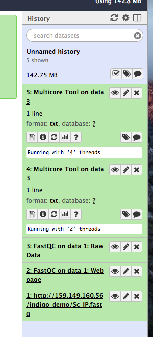
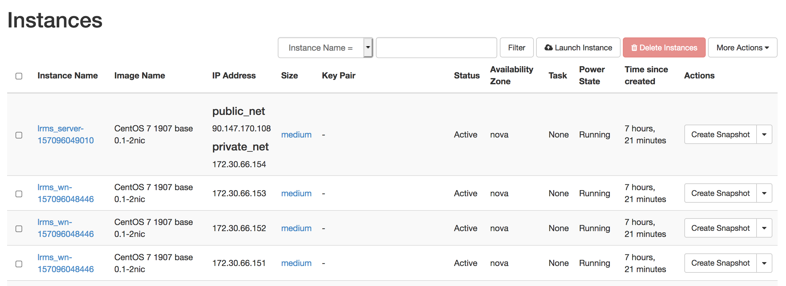
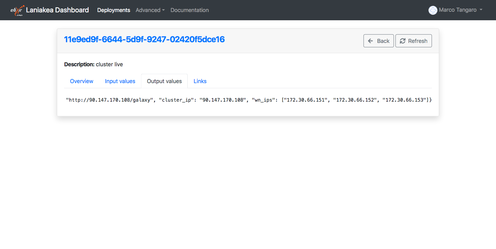
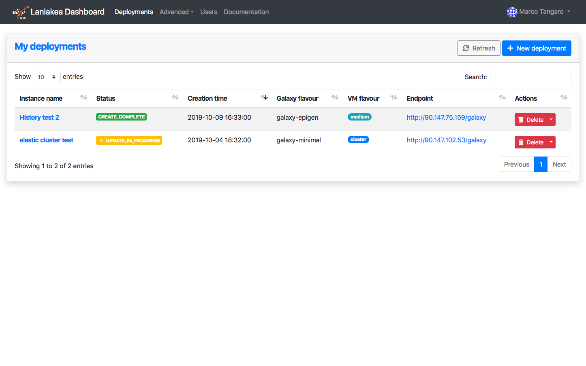
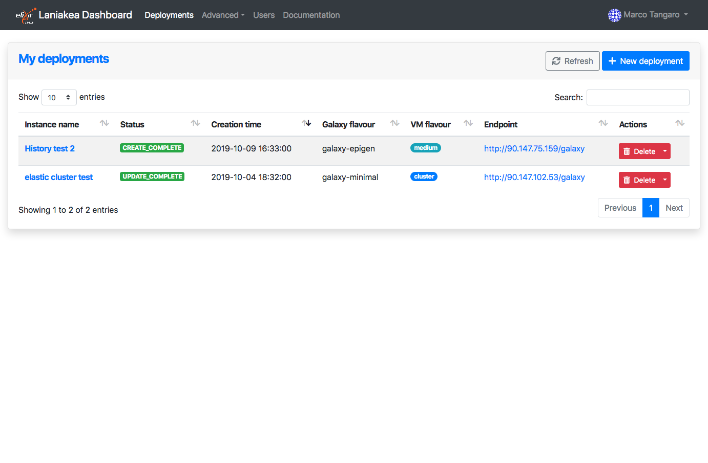

Cluster configuration
======================

|project_name| provides the possibility to instantiate Galaxy with `SLURM <slurm.schedmd.com>`_ as Resource Manager and to customize the number of virtual worker nodes and the worker nodes and front-end server virtual hardware, e.g. vCPUs and memory.

Furthermore, automatic elasticity, provided using `CLUES <https://ec3.readthedocs.io/en/latest/arch.html#clues>`_, enables dynamic cluster resources scaling, deploying and powering on new working nodes depending on the workload of the cluster and powering-off them when no longer needed. This provides an efficient use of the resources, making them available only when really needed.

Conda packages used to solve Galaxy tools dependencies are stored in ``/export/tool_deps/_conda`` directory and shared between front and worker nodes.

job_conf.xml configuration
--------------------------

SLURM has been configured following the `GalaxyProject tutorial <https://galaxyproject.github.io/training-material/topics/admin/tutorials/connect-to-compute-cluster/tutorial.html>`_.
 
In particular the number of tasks per nodes, i.e. the ``$GALAXY_SLOTS``, is set at ``--ntasks=2`` by default.

Moreover, to allow SLURM restart on elastic cluster, the number of connection retries has been set to ``100``.

::

  <?xml version="1.0"?>
  <job_conf>
      <plugins>
          <plugin id="local" type="runner" load="galaxy.jobs.runners.local:LocalJobRunner" workers="2"/>
          <plugin id="slurm" type="runner" load="galaxy.jobs.runners.drmaa:DRMAAJobRunner" workers="100">
              <param id="drmaa_library_path">/usr/local/lib/libdrmaa.so</param>
              <param id="internalexception_retries">100</param>
          </plugin>
      </plugins>
      <handlers default="handlers">
          <handler id="handler0" tags="handlers"/>
          <handler id="handler1" tags="handlers"/>
          <handler id="handler2" tags="handlers"/>
          <handler id="handler3" tags="handlers"/>
      </handlers>
      <destinations default="slurm">
          <destination id="slurm" runner="slurm" tags="mycluster" >
                  <param id="nativeSpecification">--nodes=1 --ntasks=2</param>
          </destination>
          <destination id="local" runner="local">
                  <param id="local_slots">2</param>
          </destination>
      </destinations>
      <tools>
          <tool id="upload1" destination="local"/>
      </tools>
      <limits>
          <limit type="registered_user_concurrent_jobs">1</limit>
          <limit type="unregistered_user_concurrent_jobs">0</limit>
          <limit type="job_walltime">72:00:00</limit>
          <limit type="output_size">268435456000</limit>
      </limits>
  </job_conf>

Shared file system
------------------
Current cluster configuration foresee two paths shared between front and worker nodes: 

#. ``/home`` where Galaxy is installed.

#. ``/export`` where Galaxy input and output datasets are stored. Here is also mounted the external (encrypted) storage volume, allowing to share it among worker nodes.

.. Note::

   The NFS exports configuration file is: ``/etc/exports``

For example, listing the mount points in the worker nodes:

::

  $ df -h
  Filesystem             Size  Used Avail Use% Mounted on
  devtmpfs               1.9G     0  1.9G   0% /dev
  tmpfs                  1.9G     0  1.9G   0% /dev/shm
  tmpfs                  1.9G   17M  1.9G   1% /run
  tmpfs                  1.9G     0  1.9G   0% /sys/fs/cgroup
  /dev/vda1               20G  2.3G   18G  12% /
  172.30.66.154:/home     20G  3.9G   17G  20% /home
  172.30.66.154:/export   47G  537M   44G   2% /export
  tmpfs                  379M     0  379M   0% /run/user/1000
  cvmfs2                 4.0G   68K  4.0G   1% /cvmfs/data.galaxyproject.org

.. note::

   The CVMFS repository is mounted on each node of the cluster.

Network configuration
---------------------

The front node, hosting Galaxy and SLURM, is deployed with a public IP addess. Moreover, a private net is created among front and worker nodes. The worker nodes are not exposed to the internet, but reachable only from the front node, because they connected only with the private network.

Worker nodes SSH access
-----------------------

It is possible to SSH login to each deployed worker node from the front node, i.e. the Galaxy server.

The SSH public key is availeble at ``/var/tmp/.im/<deployment_uuid>/ansible_key``. The ``deployment_uuid`` is a random string which identifies your deployment and in the only directory in the path ``/var/tmp/.im``. For examples:

::

  # cd /var/tmp/.im/748ee382-ed9f-11e9-9ace-fa163eefe815/
  (.venv) [root@slurmserver 748ee382-ed9f-11e9-9ace-fa163eefe815]# ll ansible_key
  ansible_key      ansible_key.pub

The list of the worker nodes ip address is in the ``Output values`` tab of the deployment, as ``wn_ips``:

Finally, you can connect to worker nodes as:

::

  ssh -i ansible_key cloudadm@<wn_ip_address>

where ``wn_ip_address`` is the worker node ip address

Worker nodes deployment on elastic cluster
------------------------------------------

.. Warning::

   Each node takes 12 minutes or more to be instantiated. Therefore, the job needs the same time to start. On the contrary, if the node is already deployed, the job will start immediately.

This is due to: 

#. Virtual Machine configuration

#. CernVM-FS configuration

#. SLURM installation and configuration

During the worker node deployment and delete procedure the Dashboard will show the status ``UPDATE_IN_PROGRESS``:

When the worker node is up and running or once it is deleted the Dashboard will show the status ``UPDATE_COMPLETE``:

References
----------

`Connecting Galaxy to a compute cluster <https://galaxyproject.github.io/training-material/topics/admin/tutorials/connect-to-compute-cluster/tutorial.html>`_

`SLURM main commands <https://www.rc.fas.harvard.edu/resources/documentation/convenient-slurm-commands/>`_

`Sbatch commands <https://slurm.schedmd.com/sbatch.html>`_
