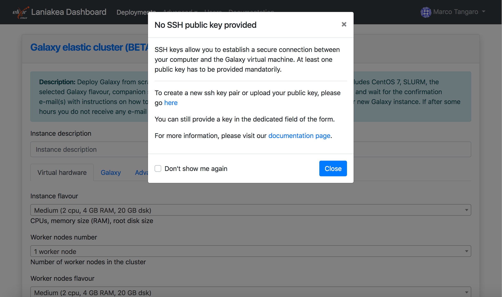
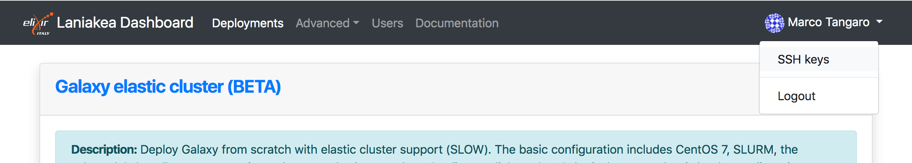
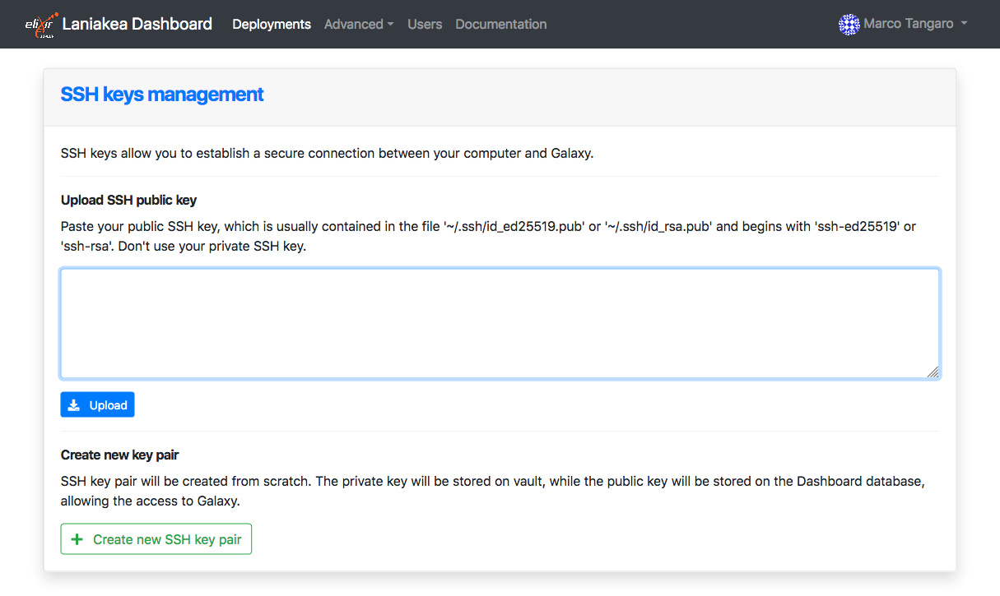
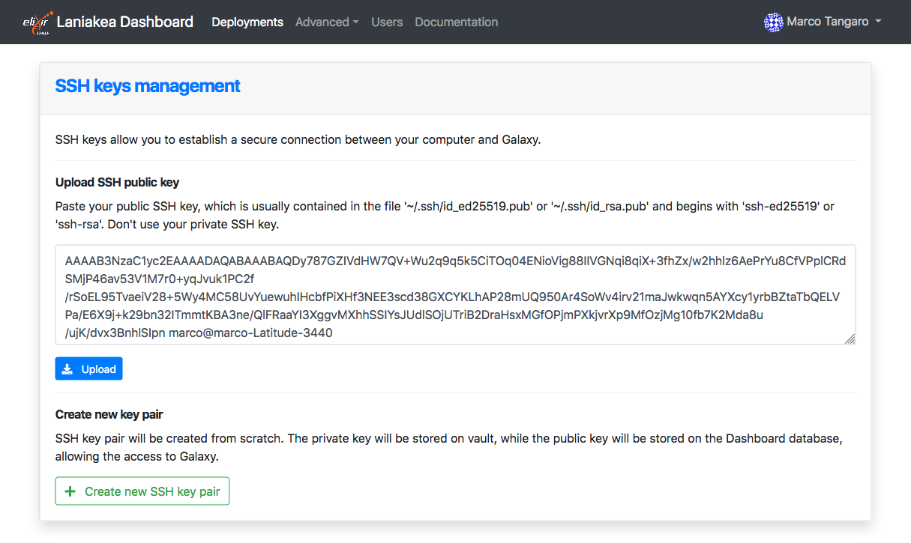
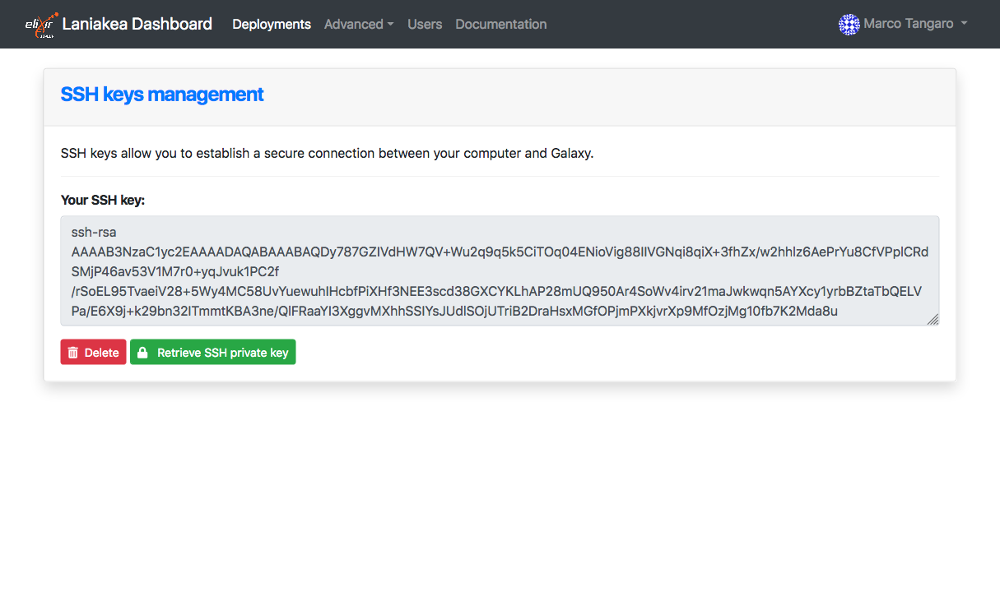
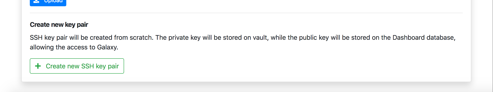
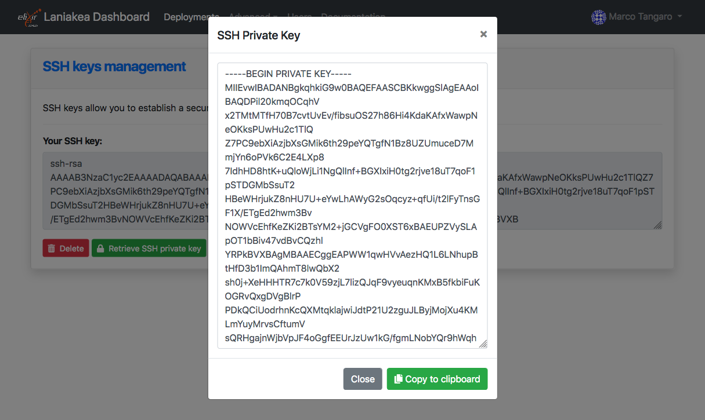
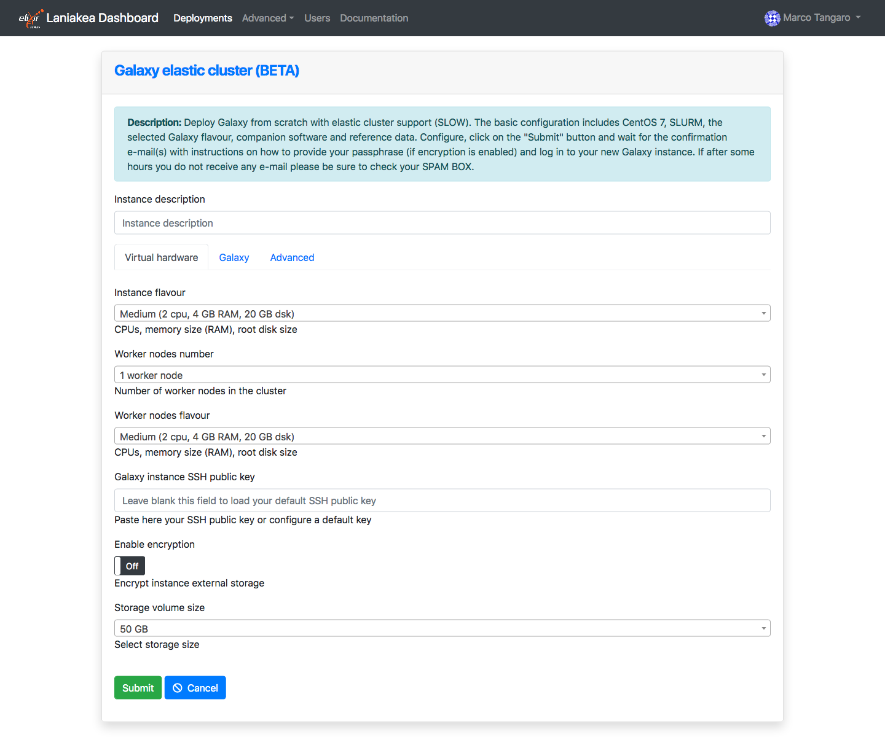
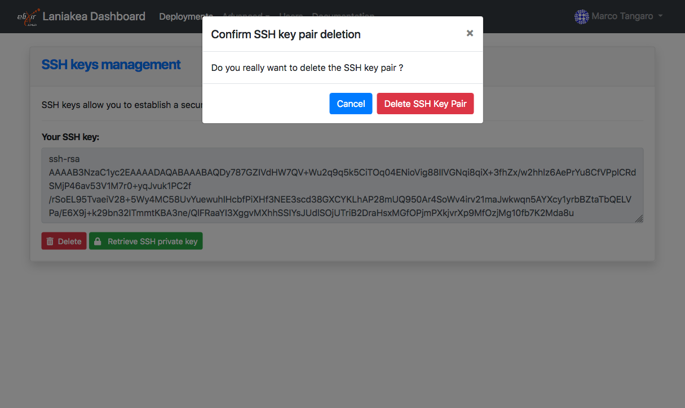

Create SSH Keys
===============

SSH keys allow you to establish a secure connection between your computer and Galaxy.

Generating a key pair provides you with two long string of characters: a public and a private key. Laniakea upload the public key on the Galaxy server and then unlock it by connecting to it with a client that already has the private key. When the two match up, the system unlocks without the need for a password. You can increase security even more by protecting the private key with a passphrase.

.. warning::

   Laniakea requires **ONLY** a SSH public key to instatiate Galaxy and grant you the access on the Virtual Machine.

Create your SSH key with Laniakea
---------------------------------

During the Galaxy instance configuration procedure a SSH public key has to be mandatorly provided. This field, in fact, is required and without the SSH key you won't be able to submit your deployment.

.. warning::

   FOR SECURITY REASONS THE SSH KEY OF  A VIRTUAL INSTANCE CANNOT BE CHANGED FROM THE LANIAKEA DASHBOARD AFTER ITS DEPLOYMENT. IF NEEDED, AND IF YOU KNOW WHAT YOU ARE DOING,  IT CAN STILL BE MODIFIED ACCESSING DIRECLY THE INSTANCE VIA SSH.

   **NOTICE THAT IF YOU LOSE THE PRIVATE KEY CORRESPONDING TO THE PUBLIC ONE ON THE VM HOSTING YOUR GALAXY INSTANCE, IT WILL BECOME UNACCESSIBLE FOREVER.**

.. role:: red

An example of using :red:`interpreted text`

For this reason the Laniakea dashboard provides a menu to upload/create the user public (and private) key, in the top left user menu.

This will load the SSH management page, which will allow you to upload a SSH public key or generate a SSH key pair.

We recommend you to manually generate your SSH key pair and then upload the SSH public key on Laniakea. Paste your public Key in the text box

and press the upload button.

If you don't have a public key, it is possible to create a SSH key pair, i.e. a public and a private key.

.. warning::

   The private key is not exploited by Laniakea. Is only generated and uploaded on Vault for security. Please download it. The Laniakea team will not be held liable for lost data due to hardware failure, virus, spyware, corruption or any other situation.

And then retrieve it with the ``Retrieve SSH private key`` button.

Once the public SSH key is available on the Dashboard the service will recognize it and it no longer needs to be loaded.

Remove the SSH key from Laniakea
--------------------------------

It is possible to delete the SSH key (pair) from Laniakea with ``Delete`` button.

.. warning::

   The key will not be removed from the virtual instances where it has been inserted. Once removed, if not saved elsewhere, and if no different keys were added, you will not be able to access the instances.

How to create SSH keys on Linux or macOS
----------------------------------------

https://www.digitalocean.com/docs/droplets/how-to/add-ssh-keys/create-with-openssh/

How to create SSH keys on Windows
---------------------------------

https://docs.microsoft.com/en-us/azure/virtual-machines/linux/ssh-from-windows
