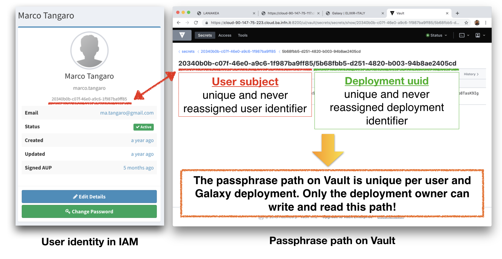

Vault configuration
===================

Hashicorp Vault is a tool for securely accessing “secrets" and is exploited on Laniakea to store and manage user encrpyptin passphrases.

A secret is everything you want to tightly control access to, such as encryption passphrases. Data stored on Vault are encrypted with 256 bit AES (Advanced Encryption Standard) cipher in the Galois Counter Mode (GCM) with a randomly generated nonce.

Laniakea by default exploits `kv-v2 <https://www.vaultproject.io/docs/secrets/kv/kv-v2.html>`_ secrets engine to store secrets within the configured physical storage for Vault.

Vault main concepts
-------------------

#. Paths: everything in Vault is path based: users are able to write their secrets on a specific path, depending on their Identity.

#. Tokens are the core method for authentication within Vault. After the authentication on the Laniakea Dashboard, tokens are dynamically generated based on user identity.

#. Policies provide a declarative way to grant or forbid access to certain path and operations, controlling what the token holder is allowed to do within Vault.

**A token generated with a specific policy allows to write/read/update a secret in a specific path.**

Vault authentication and authorization flow
-------------------------------------------

Laniakea exploits a set of four different policies for secrets management:

#. The first policy needed is named ``kv-2`` and is used to issue new tokens and grant permissions on the Vault UI.

   ::

     # Manage tokens
     path "auth/token/*" {
       capabilities = [ "create", "read", "update", "delete", "sudo" ]
     }
     
     # Grant permissions on user specific path
     path "secrets/data/{{identity.entity.aliases.<jwt_auth_accessor>.name}}/*" {
         capabilities = [ "read" ]
     }
     
     # For Web UI usage
     path "secrets/metadata" {
       capabilities = ["list"]
     }

#. The **write onlyi.hcl** token is exploited by LUKS script on the Virtual machine during the encryption procedure to store passphrases on Vault.
   
   ::
   
     # Grant permissions on user specific path
     path "secrets/data/{{identity.entity.aliases.<jwt_auth_accessor>.name}}/*" {
       capabilities = [ "read" ]
     }

   The ecryption script write the random generated passphrase on vault on Vault, in a path where only the user can access, since it depends on its identity.
 
#. The Laniakea Dashboard can Read, if required by the user, after the authentication, the passphrase from Vault using the **read_only.hcl** policy.
   
   ::
   
     # Grant permissions on user specific path
     path "secrets/data/{{identity.entity.aliases.<jwt_auth_accessor>.name}}/*" {
         capabilities = [ "create"]
     }

   Users can read their passphrases through the dashboard after authenticating.
   
#. Finally, the Laniakea Dashboard Deletes the passphrase from Vault, once the deployment is deleted using the **delete_only.hcl** policy.

   ::

     # Permanently remove all versions and metadata for a key
     path "secrets/metadata/{{identity.entity.aliases.auth_jwt_9144d398.name}}/*" {
         capabilities = ["delete"]
     }

   The passphrases are automatically deleted from Vault once the Galaxy instance is deleted.

.. figure:: img/vault_auth_flow.png
   :scale: 40%
   :align: center

Vault passphrase storage flow
-----------------------------

On the Dashboard:

#. The dashboard exploits the JWT token (from IAM) to get Vault token using the ``kv-2`` policy. This token should not be revoked until the write procedure is finished, otherwise also the children token are revoked.

#. The vault token is used to get a `wrapping token <https://learn.hashicorp.com/vault/secrets-management/sm-cubbyhole>`_ :

   - with write_only policy, i.e. the token can only write (not update) a new secret on vault.

   - it can be used only one time.

   - limited in time duration (currently configured to expire after 12 hours).

  The wrapping token is sent to the VM, via tosca template, with the vault path where the seecret has to be stored. These information are sent to the VM, all needed to store a secret on vault using kv-v2:

   - The path of the secret: secrets/<user_subject>/<deployment_uuid>. This allows to have **user identity** and **deployment uuid** dependent path for every secret

   - wrapping token

   - key name: the kv secret has key and its value. The value, i.e. the encryption passphrase, is automatically filled by luks script (it is randomly generated).

On the Virtual machine:

#. The ansible role on the VM run the fast-luks script to encrypt storage.

#. The (alphanumerical) passphrase is randomly generated.

#. The wrapping token is unwrapped, thus obtaining the privileged token with write (only) permissions to the secrets path.

#. The passphrase is written to secrets/<user_subject>/<deployment_uuid> path.

#. The token used to write the passphrase is revoked.

Finally, if required, the dashboard crate a read_only token to show the passphrase to the user.

.. figure:: img/vault_storage_flow.png
   :scale: 50%
   :align: center

Passphrase path on Vault
------------------------

Each passphrase is stored on vault on /secrets path. Each one depends on 

#. User subject (issued by IAM): a unique and never reassigned user identifier

#. Deployment uuid (issued by the Dashboard): a unique and never reassigned deployment identifier.

This procedure results to have a passphrase path on Vault unique per user and Galaxy deployment. Only the deployment owner can write and read this path.

